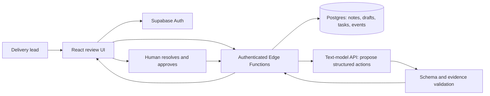

# Hackathon product recommendation By GPT-6 Astra: CommitClear

Prepared 25 September 2026 • Cloud Platform Architect and Platform Engineer perspective

## 1. Recommendation

**Choose the Task Management App, specialized as CommitClear: a meeting-to-commitment review tool for delivery leads in small software and client-service teams.** Working name only; trademark and domain availability are not checked.

Product promise: **Turn messy meeting notes into commitments you can explain, clarify, approve, and track.**

The strongest opportunity is the moment between a discussion and a saved task: someone must resolve an unclear owner, competing deadlines, or a tentative suggestion that sounds like a commitment. Make that moment the center of the product.

Recommended core flow:

**Paste notes → extract proposed actions with source passages → flag uncertainty → resolve and approve → save tasks → update status → reload and verify persistence.**

My judgment is that this offers the best balance of problem clarity, achievable functionality, creativity, and presentation under the supplied rubric. It is not a prediction of the judges' scores or a guarantee of winning. A generic AI task board would be a substantially weaker entry.

The first release should serve one signed-in delivery lead who manages named participants. A lead's approval is not proof that an assignee has personally accepted a task. Make that distinction explicit in the interface.

## 2. Evidence, scope, and uncertainties

### Materials inspected

1. [Product Building - Playbook.md](</Users/zaheerabbas/GitHub/aigeneralist_hackathon/4.Vibe_Coding/Product Building - Playbook.md>) — workbook, example, and submission guidance.
2. [Product Ideas for Accelerator.md](</Users/zaheerabbas/GitHub/aigeneralist_hackathon/3.Product_Ideas/Product Ideas for Accelerator.md>) — all eight candidate ideas.
3. [EvaluationCriteria.png](</Users/zaheerabbas/GitHub/aigeneralist_hackathon/EvaluationCriteria.png>) — supplied judging slide, visually reviewed.

Only these named project sources were inspected. A previous analysis was consulted for continuity, but this recommendation was reassessed against the newly supplied judging rubric and current competitor documentation. Source files were not modified. The workbook's embedded prompts, account setup steps, and submission instructions were treated as document content; no accounts, deployments, messages, or submissions were created.

Labels used here:

- **SOURCE FACT:** stated in the supplied materials or a linked official source.
- **RECOMMENDATION:** my design or prioritization judgment.
- **INFERRED:** plausible hypothesis requiring validation.
- **UNKNOWN:** not established by the materials or this research.

### What the judging slide actually says

| Criterion | Wording on the supplied slide | Evidence your demo should provide |
| --- | --- | --- |
| Understanding of the problem | “Do you know who it's for and why it hurts?” | One specific persona and a recognizable failure in a meeting |
| How functional the app is | “Does it work end to end?” | Real extraction, review, database save, edit, status change, and reload |
| Creativity | “A fresh take, not a template.” | Resolve uncertainty using visible evidence before committing work |
| Presentation | “UI, aesthetics and storytelling in the walkthrough.” | A polished review screen and concise before/after story |

**UNKNOWN:** weights, tie-break rules, other teams' entries, exact submission deadline and timezone, team size, remaining time, budget, and required technologies.

**Timing conflict:** the workbook describes three days; the slide header says “48 Hour AI Challenge” and Thursday, September 24, 2026. Use a conservative 48-hour elapsed-time plan, but verify the actual deadline with the organizer. Do not assume 48 hours remain from today.

**Demo-length distinction:** the workbook describes a 3–5 minute demo exercise, but its submission section requests a **2–3 minute Loom walkthrough**. Prepare a 2:45 submission recording and a longer live version only if allowed.

**SOURCE FACT:** the workbook emphasizes one end-to-end flow, MoSCoW prioritization, up to two should-haves, functional CRUD, repeated scenario testing, and one small wow feature. Its Travel Itinerary Planner is a worked example, not a ninth idea in the supplied product list. The example also expands scope in places; use the explicit one-flow/two-should-have rule as the planning constraint.

## 3. Comparison of every candidate

These are **subjective design scores**, not measured outcomes. Each criterion is scored 1–5: 1 = weak under the assumed time limit, 3 = workable with material tradeoffs, 5 = especially strong. Equal weights are an analytical assumption because the slide gives no weights. Totals are out of 20 and are not win probabilities. Scores evaluate the focused variants below, not every possible implementation.

| Rank | Source idea and proposed angle | Problem | Functionality | Creativity | Presentation | Total |
| --- | --- | ---: | ---: | ---: | ---: | ---: |
| 1 | Task Management App — clarify commitments before saving | 5 | 4 | 4 | 5 | 18 |
| 2 | Resume-to-Interview Coach — evidence-based gap practice | 5 | 4 | 3 | 5 | 17 |
| 3 | Pet Care Companion — shared caregiver handover | 4 | 4 | 4 | 4 | 16 |
| 4= | Campaign Planner — controlled experiment calendar | 4 | 5 | 2 | 4 | 15 |
| 4= | AI Interior Makeover — constrained makeover concepts | 4 | 3 | 3 | 5 | 15 |
| 6 | Personal Finance Manager — explainable expense categorization | 4 | 4 | 2 | 4 | 14 |
| 7= | Collaborative Notetaker — decisions separated from discussion | 4 | 3 | 2 | 4 | 13 |
| 7= | Personal Health Manager — habit reflection | 4 | 4 | 2 | 3 | 13 |

### Why these scores

**Task Management App:** Directly matches the source idea, provides obvious state changes, and gives AI a useful extraction role. Conflict review creates an understandable reveal. Biggest risks: crowded market and unreliable interpretation. Constrain the input and keep human decisions visible.

**Resume-to-Interview Coach:** Strong runner-up with a relatable user journey. Differentiate through resume evidence → job requirement → answer attempt → cited feedback → improvement attempt. Document parsing and credible feedback need care. Personalized interview questions and feedback already exist in [Interviews by AI](https://interviewsby.ai/), including resume upload on its stated Pro offering. Do not claim those features are new.

**Pet Care Companion:** A handover between two caregivers can expose missed or duplicate routine care in an emotionally understandable story. This is a promising alternative if you can speak to pet owners immediately. Routine management is feasible; avoid turning it into diagnosis or dosage advice. Its creative score is a hypothesis about the handover focus, not verified market novelty.

**Campaign Planner:** Easy to demonstrate from brief to editable calendar. A test hypothesis, two variants, and a user-entered outcome can provide focus. Real campaign improvement cannot be established during a short demo. AI content calendars already exist; [Junia's Content Planner](https://www.junia.ai/docs/how-to-use-the-content-planner) is one adjacent example, not an exact equivalent to the full source idea.

**AI Interior Makeover:** Best immediate visual impact. However, generated images may alter room geometry, and API latency can weaken the live flow. [RoomGPT](https://www.roomgpt.io/) already offers room redesign. A “preserve these objects” feature is an interesting target, but do not promise precise preservation unless tested. Choose this only with a proven image pipeline and strong design skills.

**Personal Finance Manager:** Clear workflow, but a categorization dashboard alone offers limited creative distinction. A strong variant would explain uncertain categories and support corrections. Avoid bank integrations in this timebox. Numeric totals must come from code, not generated prose.

**Collaborative Notetaker:** Real-time editing introduces synchronization and conflict handling work. Summaries and action items are already central to [Notion's meeting notes](https://www.notion.com/product/ai-meeting-notes). A separate decisions register is useful but still requires a sharper user story.

**Personal Health Manager:** Habit logging is manageable. Meaningful health improvement cannot be demonstrated in hours, and a general summary has limited novelty. Keep the scope to user-entered habits and reflection rather than clinical recommendations.

### Sensitivity and decision rule

The one-point lead over Interview Coach is not decisive on its own. If CommitClear ships only generic extraction and a board, reduce its creativity score from 4 to 2: its total becomes 16, below Interview Coach. If image generation is already reliable and your team excels at visual design, Interior Makeover becomes more competitive. If you have direct access to caregivers and no access to delivery leads, Pet Care may provide better problem evidence.

**Stay with CommitClear if you can ship the clarification workflow and validate it with at least two plausible users.** Your platform engineering perspective is useful for designing trustworthy state transitions and observable failures; it should support the user experience rather than dominate the pitch.

## 4. Competitive reality and the differentiation claim

Research checked on 25 September 2026 using official vendor pages. This was a documentation scan, not a hands-on comparison or exhaustive market search. Vendor claims are not independent performance measurements. Pricing and plan eligibility were not comprehensively evaluated.

| Product | Confirmed overlap | Implication for CommitClear |
| --- | --- | --- |
| Asana + Zoom | Tasks, action items, searchable meeting transcripts, and recordings | Basic meeting-to-work linkage is established. [Official integration](https://asana.com/apps/zoom) |
| Fireflies + Any.do | Creates tasks from meeting action items and includes a recording/transcript link | Source links alone are not a differentiator. [Official guide](https://guide.fireflies.ai/articles/1405669320-how-to-integrate-any-do-with-fireflies) |
| Jira + Rovo | Generates suggested work items that users review and refine before creating | Human review and editable AI proposals already exist. The page notes gradual rollout. [Official guide](https://support.atlassian.com/jira-software-cloud/docs/create-work-items-with-rovo/) |
| Fellow | AI action items, decisions, and accountability-oriented workflows | “AI accountability” alone is too broad a claim. [Official feature page](https://fellow.ai/features/action-items) |
| Notion | AI meeting notes and action-oriented workflows | A notes page with a summary button is insufficient. [Official product page](https://www.notion.com/product/ai-meeting-notes) |

**Recommended positioning:** “For delivery leads leaving a messy client meeting, CommitClear shows what is agreed, what is unclear, and what needs a decision before work enters the board.”

**Defensible creative angle:** a compact clarification experience combining field-level source evidence, visible contradictions, explicit reviewer resolutions, and a saved commitment receipt.

**UNKNOWN:** whether another product offers precisely this combination. Absence from a vendor page does not prove absence from its product. Say “our focused workflow” rather than “the world's first.” Actual frustrations with competing tools remain unvalidated; do not invent customer complaints.

## 5. The user problem to validate

Primary user: a delivery lead in a small software agency coordinating client commitments after project meetings. This is a chosen segment, not a fact established by user research.

**INFERRED pains:** tentative statements become firm tasks; conflicting dates are silently resolved by a person or AI; and later nobody can explain why an owner or deadline was selected.

Working five-whys chain: work is missed → meeting output is unclear → notes mix proposals and commitments → converting prose into tasks hides uncertainty → teams need a quick clarification step before accepting the plan. Each link is a hypothesis to test.

Ask two or three leads to use a sanitized example. Ask what they would create as a task, what remains ambiguous, how they currently clarify it, and whether this screen reduces their review effort. Record observations and exact quotes with permission. Do not ask only “Would you use this?”

Success target: a first-time user can turn a short note into two approved tasks, correctly resolve one conflict, and reopen the saved result within three minutes. This is a target, not an achieved metric.

## 6. Special features and strict priorities

### Build these as one core experience

| Feature | Behavior | Why it matters | Acceptance condition |
| --- | --- | --- | --- |
| Source-backed action cards | Every extracted action links to exact note text; owner and date have their own evidence where present | Makes review concrete | Invalid source references cannot appear as verified evidence |
| Clarification queue — hero feature | Flags missing owner, ambiguous date, tentative language, or competing values | Makes uncertainty actionable | User can resolve, defer, or reject; unresolved required fields cannot enter Ready |
| Targeted clarification prompt | Shows “Who owns this?” or “Which of these dates is agreed?” alongside evidence | Helps a lead decide what to ask next | A question is shown in-app; it is not automatically sent |
| Commitment receipt | Shows source values, reviewer changes, reviewer identity, and approval time | Explains how the final task came to exist | Reload preserves the receipt and task |
| Minimal task lifecycle | Ready → In progress → Done, with reopen and deletion/archive behavior | Completes the source product promise | Status and edits persist in the database |

These are parts of one review flow, not five separate products. “Source verified” means the quoted text exists in the supplied note. It does not prove that the meeting statement is true or that the AI interpretation is correct.

### At most two should-haves, after the core works

1. **Commitment change review:** user selects an existing task and a later note; AI proposes changed owner/date values with old/new evidence. Accepting changes requires an explicit comparison and version check. Limit to a selected task; cross-project automatic matching is out of scope. Estimated extra work: 4–6 focused hours, uncertain until the core exists.
2. **Completion evidence:** an optional link or short note describes what “done” means and what was delivered. Label it “evidence supplied,” not “outcome verified.” Estimated extra work: 1–2 focused hours. Do not fetch arbitrary links in the MVP.

If only one fits, choose change review when the team has enough implementation time; otherwise choose completion evidence. Neither should delay basic persistence, security checks, or the recording.

### More distinctive ideas for the backlog

| Idea | Concrete behavior | Value and constraint | Priority |
| --- | --- | --- | --- |
| Owner acceptance | Assignee accepts or proposes a new date | Separates assignment from actual commitment; requires real user identities | After hackathon |
| Dependency impact preview | User changes a prerequisite date and sees affected tasks | Useful for delivery planning; dependencies and durations must be supplied, not invented | After hackathon |
| Contradiction history across meetings | Compare later statements with approved commitments | Shows evolving agreements; needs reliable identity matching and evaluation | After selected-task change review |
| Repeated deferral signal | Count how often a task's deadline changes and show reasons | Transparent alternative to an opaque risk score; counts do not establish why delays occurred | Could |
| Definition-of-done builder | Suggest an editable acceptance checklist with suggestions clearly labeled | Makes vague work testable; never present suggestions as source facts | Could |
| Next-meeting clarification agenda | Export unresolved questions and overdue items | Closes the loop without notification integrations | Could |
| Bilingual notes with original evidence | Display translated explanation beside the original passage | Useful for multilingual teams; needs names/date/language evaluation | Later |
| Commitment export | Download approved tasks and receipts as Markdown or CSV | Fits existing team tools with little integration burden | Could |
| Incident follow-up template | Capture post-incident actions, owner, success condition, and evidence | Strong platform/SRE extension using sanitized data | Later vertical |
| Privacy controls | User-managed deletion and explicit control over content sent to AI | Supports trust; do not claim zero retention without verifying every processor | Later expansion; basic deletion in MVP |

Avoid adding a chatbot homepage, automatic Slack/email posting, live meeting bots, autonomous rescheduling, predictive completion percentages, a vector database, or a full project-management suite during this build. They add work without strengthening the central demo.

## 7. Architecture

### Recommended stack

Use **Bolt-generated React/TypeScript UI, Supabase Auth + Postgres + Edge Functions, and one server-side text-model API**. This follows the source idea's suggested stack. If the team already has a working alternative, keep it; switching tools can cost more than it gains. Use one static frontend deployment on a host the team already knows.

The model provider and model identifier should be configuration choices made after testing structured extraction on the evaluation notes. Access, billing, exact versions, hosting limits, and latency are UNKNOWN until verified in the team's accounts. Do not build a multi-provider routing layer for the hackathon.



The model proposes data. Application code validates it. An authenticated user approves it. A database transaction commits it. AI receives no database credentials and cannot invoke task mutations.

### Screens

1. **Meeting intake:** paste notes, choose meeting date/timezone, add participant names, or load clearly labeled synthetic sample data.
2. **Review desk:** source text on the left; action cards and uncertainty badges on the right. Clicking evidence highlights the relevant passage. Provide Resolve, Defer, Reject, and Approve actions.
3. **Task board with detail drawer:** simple statuses; edit fields; inspect the receipt; reopen or archive a task. Prioritize legibility over drag-and-drop animation.

Use text and icons as well as color. Keep buttons keyboard accessible. Distinguish “Ready to approve,” “Needs clarification,” and “Saved” in language a delivery lead understands. Do not place token counts or internal schemas in the main user flow.

### Minimal data model

| Entity | Essential fields |
| --- | --- |
| meetings | id, user_id, title, occurred_at, timezone, original_text, source_hash, source_version |
| extraction_runs | id, user_id, meeting_id, source_version, status, model_id, prompt_version, latency_ms, token_usage, error_code, request_key |
| drafts | id, user_id, meeting_id, run_id, title, proposed_owner, proposed_due_date, raw_date_text, evidence_json, issues_json, review_state |
| tasks | id, user_id, draft_id nullable, title, owner_name, due_date nullable, status, version, approved_by, approved_at, completion_note nullable |
| task_events | id, user_id, task_id, actor_id, event_type, before_json, after_json, source_version, created_at |

`evidence_json` maps each extracted field to a stable source segment and exact quote. A source revision creates a new version; it does not silently change evidence for approved tasks. Manually added tasks are labeled manual and do not pretend to have extraction evidence.

For the hackathon, `user_id` isolates each lead's workspace. Named participants are labels, not authenticated collaborators. Add organizations, memberships, invitation flows, and member-specific permissions only when actual collaboration is built.

### API and state rules

- `extract(meeting_id, source_version, request_key)`: verifies ownership, enforces size/rate limits, calls the model, validates output, and saves drafts. Reusing a request key returns the existing run rather than creating duplicates.
- `approve(draft_id, reviewed_fields, resolution_notes, expected_version)`: checks ownership and outstanding issues, then atomically creates a task and receipt. A unique constraint on the originating draft prevents duplicate approval.
- `update_task(task_id, expected_version, changes)`: rejects stale updates and records an event. Changing a reviewed field records who changed it.
- `delete_meeting` / `delete_task`: explicit user action with a clear warning about affected records. Define cascade behavior; do not leave orphaned private notes in the database.

Draft states: Proposed → Needs clarification or Ready for review → Approved / Rejected / Deferred. Only approval creates a board task. A missing date can be resolved as **“No deadline agreed”** with reviewer acknowledgment; it must not be silently guessed. Missing ownership stays deferred until the reviewer supplies an owner or explicitly rejects the action.

### Extraction contract and uncertainty

Return structured fields, not generated HTML. Include `title`, `owner|null`, `due_date|null`, `raw_date_text|null`, per-field evidence, and issue codes such as `MISSING_OWNER`, `AMBIGUOUS_DATE`, `CONFLICTING_DATES`, or `TENTATIVE_ACTION`.

Validate the shape and maximum lengths in code. Verify that segment IDs exist and quoted text matches the frozen source. This checks citation integrity, not semantic correctness. Contradiction and tentativeness detection remain fallible AI proposals requiring review.

Resolve relative dates only with meeting date and timezone, and show the original phrase plus proposed interpretation. Ambiguous expressions such as “next Friday” should require confirmation. Display evidence states rather than uncalibrated confidence percentages.

### Security, reliability, cost, and operations

Keep provider credentials in server-side secrets. Supabase documents secrets for Edge Functions and warns against exposing privileged keys to the browser. [Official secrets guidance](https://supabase.com/docs/guides/functions/secrets)

Apply ownership checks and row-level security to every exposed data table; test with two accounts. A privileged server path must enforce authorization explicitly rather than assuming RLS protects it. [Official RLS guidance](https://supabase.com/docs/guides/database/postgres/row-level-security)

Treat note text as untrusted input. Instructions inside notes must remain data. Give the model no tools; render its output as escaped text; allow only expected fields and URLs. Show users that their submitted notes will be sent to the selected AI provider.

Proposed initial controls: 12,000-character input limit, maximum 15 action drafts per run, bounded output, one extraction at a time per user, a persisted rate limit, and a configured daily usage budget. These are design defaults to tune, not vendor limits. Reject oversize input clearly rather than truncating it silently.

Use a timeout compatible with the deployed runtime. Retry only transient failures within a bounded budget. Preserve the note and offer manual drafting after failure. If repeated requests risk exceeding the host's time limit, reduce input size first; add background jobs only after measured need.

Log request ID, duration, provider status, validation errors, token usage, and prompt/model versions. Do not log full meeting content by default. Estimate model cost as input tokens × current input price + output tokens × current output price, including retries; add hosting/database charges. A supported dollar estimate requires account and model selection.

Keep migrations and prompts in version control. Deploy a preview early, run the complete flow there, then promote a known working build. Preserve a rollback revision and a synthetic demo workspace. Test the live deployment, not just localhost.

Kubernetes, Terraform modules, service meshes, Kafka, and multi-region deployment are unnecessary for this MVP. Your architecture judgment is demonstrated by choosing a small system with clear trust boundaries. After validation, add workspace membership, backups and restore drills, retention policy, richer monitoring, and integrations according to actual demand.

## 8. Build plan and scope gates

Assumption: one builder, up to 48 elapsed hours from project start, with approximately 30 focused working hours plus rest and contingency. Adjust to the confirmed deadline. If teammates are available, assign product/demo, implementation, and QA responsibilities; one person can wear all three roles sequentially.

| Elapsed window | Work | Concrete exit condition |
| --- | --- | --- |
| H0–H2 | Confirm rules/deadline, speak to two users, freeze persona and scope | One problem statement, one hero scenario, explicit exclusions |
| H2–H5 | Sketch review desk; scaffold app, auth, DB; deploy preview | A signed-in user can create and reload a manual task |
| H5–H10 | Notes intake and server-side extraction | Real model response validates and produces editable drafts |
| H10–H14 | Evidence display and clarification queue | Missing and conflicting values are visible; no silent approval |
| H14–H18 | Approval transaction, receipt, board, edit/delete | Complete flow works twice and survives refresh |
| H18–H26 | Rest and contingency | Preserve a known working build |
| H26–H30 | Evaluate unseen notes, fix authorization and retry issues | Critical test cases pass; measured results recorded |
| H30–H33 | One should-have only if gates passed; otherwise fixes | Hero flow remains stable |
| H33–H36 | UI polish, demo script, recording, submission pack | Live URL, 2–3 minute recording, pitch deck, team details ready |
| H36–H44 | Rest and contingency | Avoid last-minute feature expansion |
| H44–H48 | Final deployed smoke test and submission buffer | Portal requirements checked and submission receipt retained |

**Cut rules:** if persistence is not working by H5, stop UI embellishment. If extraction is unreliable by H10, reduce input scope and improve the contract. If approval is not working by H18, remove both should-haves. After H30, add no new architectural dependencies.

**If fewer than 24 hours remain:** keep three screens, pasted text only, one-account workspaces, extraction, basic uncertainty flags, human review, receipts, and persistent task status. Remove both should-haves and all integrations. Reserve the final quarter of the remaining time for verification and submission. If fewer than eight hours remain and nothing exists, prioritize the smallest real flow; competitive quality cannot be assumed.

## 9. Demonstration scenario

Use synthetic notes explicitly labeled as such. For reproducibility, choose a fixed meeting date rather than relying on the day of the demo.

```text
Meeting: Client portal delivery review
Meeting date: 2026-09-24; timezone: Asia/Kolkata
[1] Maya: I will send the revised onboarding copy by 2026-09-25.
[2] Ravi: The payment test report must be ready by 2026-09-25.
[3] Ravi: I can own that report, but the earliest I can commit is 2026-09-28.
[4] Maya: We still need to agree which report deadline works for the client.
[5] Lead: Someone should review the accessibility checklist.
[6] Ravi: Maybe we could explore a mobile redesign next quarter; no decision today.
```

Expected behavior:

- Onboarding copy: Maya and the explicit date are supported by line 1; ready for human review.
- Payment report: Ravi is a proposed owner, but the deadline is unresolved. Show lines 2–4 and ask for clarification; do not choose the later date automatically.
- Accessibility review: owner and date are missing; defer or let the lead supply a documented resolution.
- Mobile redesign: tentative idea, not an approved commitment; exclude from tasks or show as a rejected/deferred suggestion.

In the demo, the lead explicitly selects a report deadline and enters a resolution note. Label it as the lead's decision, not something extracted from the original source. Approve two tasks, update one status, refresh, and reopen its receipt.

### 2:45 submission recording

| Time | What to show and say |
| --- | --- |
| 0:00–0:20 | Introduce a delivery lead leaving a meeting with two competing dates |
| 0:20–0:45 | Paste the short notes and run real extraction |
| 0:45–1:25 | Open the conflict, highlight evidence, resolve it; defer the ownerless item |
| 1:25–1:55 | Approve, save, change status, and refresh |
| 1:55–2:20 | Open the receipt showing source evidence and the human resolution |
| 2:20–2:45 | Explain tested scope, one measured result if available, and next step |

Suggested pitch: “CommitClear helps delivery leads resolve unclear meeting commitments before they become work. Here the notes contain two dates. We show both, ask for a decision, and preserve why the final task says what it says.”

If the AI service fails live, preserve the input and show the manual path. A prerecorded run or precomputed example must be labeled as such. Never present a cached fixture as fresh inference.

## 10. Verification and evidence for judges

Create ten short, human-labeled notes covering clear actions, no actions, missing owners, ambiguous relative dates, competing dates, repeated actions, corrections, tentative proposals, malicious instructions, and unexpected formatting. Keep at least two out of prompt-tuning to reveal overfitting. A small set is useful engineering evidence, not a general benchmark.

| Check | Required outcome |
| --- | --- |
| Clear action | Correct proposal with real evidence; human approval required |
| Missing owner/date | Null or unresolved state; no fabricated value |
| Conflicting dates | Conflict is surfaced, or the case is recorded as a failure to fix |
| No action / tentative idea | No invented firm commitment |
| Wrong evidence | Citation validation blocks the verified badge and approval until corrected |
| Prompt injection inside note | No instruction execution, tool use, or unauthorized mutation |
| Double-click / retry | One logical extraction/approval result, no duplicate task |
| Provider failure | Input retained, useful error, manual path available |
| Two users | Neither can read or mutate the other's records by changing IDs |
| Reload/edit/delete | Data and receipts behave according to the documented lifecycle |
| Source revision | Approved evidence stays attached to its original version |
| Deployed walkthrough | Core flow passes at least twice without hidden setup |

Record action precision (correct extracted actions / all extracted actions), recall (correct extracted actions / labeled actions), invented-field count, evidence-match rate, conflict detection results, total human review time, and median/max extraction latency. With ten samples, do not claim a robust p95.

Go/no-go targets: zero unsupported owner/date values accepted without review on the test set; all saved extracted fields have valid source references or are clearly marked human edits; duplicate approval and cross-user access tests pass. These are proposed targets; **no application has been built or tested in this analysis**.

For the problem criterion, collect observed user difficulties. For functionality, retain a working URL and test log. For creativity, show the clarification moment. For presentation, rehearse the exact deployed flow and keep the review desk visually uncluttered.

## 11. Submission and immediate actions

According to the supplied workbook, prepare a live product link, a 2–3 minute Loom video, a pitch deck using its linked template, and team details. It states that submissions are accepted only through the [Project Submission Portal](https://hackathon-group-allocator.onrender.com/dashboard), not WhatsApp or email. These are document-derived requirements; the authenticated portal and current event rules were not checked.

Suggested pitch structure: user and pain → current workaround → clarification demo → architecture in one simple diagram → measured validation and honest limitations → next step. Adapt to the organizer's actual template; it was not inspected here.

Do these next, in order:

1. Confirm the remaining time and submission requirements.
2. Validate the ambiguous-commitment problem with two delivery leads.
3. Lock the core flow and synthetic demo note above.
4. Build and deploy manual persistence before adding AI.
5. Implement extraction, evidence, clarification, and approval as one flow.
6. Test the failure cases, polish the review desk, and record the walkthrough.

**The strongest entry is the one that proves a specific useful behavior. For this product, that behavior is making ambiguity visible and resolving it before a task becomes an apparent agreement.**

## Appendix: source integrity

SHA-256 hashes recorded during analysis:

```text
Product Building - Playbook.md
3e5da2178eb548c8133acfcc02d28732f40b648c015cf1c567884752f1020ce6

Product Ideas for Accelerator.md
ed9b9678c2d373e2640ff88c2f65f646f050b1340f008c64667e3455d6409c9a

EvaluationCriteria.png
1ebc83380f33fa74c1f4845761ee65ea17bf844eae686bc67181fc517cb44137
```

The proposal, scoring, architecture, estimates, test targets, and sample notes are new analysis. They are not organizer requirements or achieved application results.
