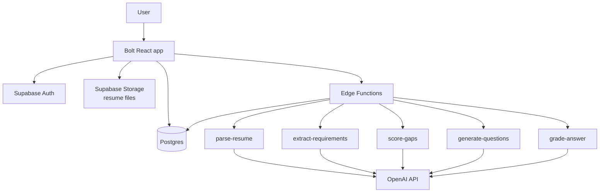

# Hackathon Product Analysis & Winning Recommendation

Sep 25, 2026 · Zaheer Abbas

## Recommendation

Build the **Resume-to-Interview Coach**, repositioned as **"JD Gap Coach"** — a tool that scores how far your resume sits from a specific job description, then drills you on exactly the gaps it found.

It wins because it is the only idea on the list that scores well on all four judging criteria at once:

- **Understanding of the problem** — the pain is sharp, dated and personal. Everyone in the room has been rejected by a JD they were qualified for. No explaining needed.
- **Functionality** — the end-to-end flow is short enough to actually finish and demo live: upload resume → paste JD → get a gap score → practise questions → get feedback. Four screens, three tables.
- **Creativity** — the ideas list describes a generic "interview coach". The fresh take is scoring the *gap* rather than generating questions, and making the score visibly improve during the demo. That is a fresh take, not a template.
- **Presentation** — a readiness score that moves from 58% to 81% live on stage is the single most demo-able artifact of any idea on the list.

The decisive factor is the creativity criterion. The other seven ideas are CRUD apps with an LLM summary bolted on; several teams in the cohort will build the same finance tracker and the same notetaker, and the judges will see them back to back. This one has a differentiator that is cheap to build and impossible to miss in a walkthrough.

## What the judges actually reward

The rubric has four criteria and no published weights, so treat them as equal quarters. Two of them are won before you write code, and two are won in the last six hours.

| # | Criterion | The question asked | What a top score looks like | Where it is won |
| --- | --- | --- | --- | --- |
| 01 | Understanding of the problem | Do you know who it's for and why it hurts? | A named user, a dated moment of pain, and a number | Phase 1 ideation |
| 02 | How functional the app is | Does it work end to end? | One flow runs twice in a row on stage, with CRUD intact | Phase 2 and 3 build |
| 03 | Creativity | A fresh take, not a template | One mechanic no other team on the list will have | Idea choice |
| 04 | Presentation | UI, aesthetics and storytelling | A clean UI and a 3-minute story with a visible before/after | Final six hours |

Three things follow from this rubric.

**Criterion 03 is the tiebreaker, and it is decided by which idea you pick.** Everyone is choosing from the same eight-item list. If you build the Personal Finance Manager, you are competing against every other team that built the Personal Finance Manager, and "a fresh take, not a template" is precisely the line you will lose on. Pick an idea with room for one distinctive mechanic, then build that mechanic.

**Criterion 02 punishes breadth, not depth.** "End to end" means one flow with no dead buttons — not eight half-built screens. The playbook says this outright: one strong end-to-end flow, not 20 scattered features.

**Criterion 04 is carried by the Loom video, not by the app.** Submission needs a 2–3 minute walkthrough and a pitch deck. Judges may score several projects from video alone, so the recording quality is worth as much as an extra feature.

## All eight ideas, scored

Each criterion scored 1–5 against the rubric. "Crowd risk" is my estimate of how many other teams in the cohort pick the same idea — it is not a judging criterion, but it directly suppresses the creativity score.

| Idea | Problem | Functional | Creativity | Presentation | Total /20 | Crowd risk |
| --- | --- | --- | --- | --- | --- | --- |
| Resume-to-Interview Coach | 5 | 4 | 4 | 5 | **18** | Medium |
| AI Interior Makeover | 3 | 3 | 5 | 5 | **16** | Low |
| Campaign Planner | 4 | 4 | 3 | 4 | **15** | Medium |
| Pet Care Companion | 4 | 4 | 3 | 3 | **14** | Low |
| Task Management App | 3 | 4 | 2 | 3 | **12** | High |
| Personal Health Manager | 3 | 4 | 2 | 3 | **12** | High |
| Collaborative Notetaker | 3 | 2 | 2 | 3 | **10** | High |
| Personal Finance Manager | 3 | 4 | 1 | 2 | **10** | Very high |

How the scores were reached:

- **Problem** — can you state who hurts, when, and how much, without hand-waving? Interview prep and campaign work both have a named user in real pain. "Tracking water intake" does not.
- **Functional** — can the core loop be finished and run twice in a row in 48 hours? Anything needing real-time sync (the notetaker) or image generation latency (interior makeover) is scored down.
- **Creativity** — is there a mechanic here that isn't in every tutorial? A budget dashboard with AI expense categorisation is the canonical LLM demo, so it scores 1.
- **Presentation** — does the output photograph well? Before/after room images and a moving readiness score are excellent. A table of expenses is not.

## Why the runners-up lose

**AI Interior Makeover (16/20)** is the most tempting alternative and the highest-variance one. Before/after room images are the best-looking demo on the list, and almost nobody else will pick it. It loses on two counts. The problem is shallow — "I'd like to see my room in a different style" is a want, not a pain, and criterion 01 asks why it hurts. And the functionality is thin: upload, generate, save is one API call wearing a trench coat, with no real data model to show. The build risk is also the worst of any idea — you depend on an image-editing API that may be slow, rate-limited or expensive, and if it is down during the demo you have nothing. Pick this only if your team already has a working image API key and one person who genuinely enjoys UI polish.

**Campaign Planner (15/20)** has a real user and real pain, and it is the closest thing to a product someone would pay for. It loses on creativity and on demo legibility. Every output is a wall of generated text, and judges cannot assess whether AI-written ad copy is good in the thirty seconds they look at it. "The AI wrote a lot of words" is not a visible win, and a marketing calendar full of LLM prose looks identical to every other LLM prose demo in the room.

**Personal Finance Manager** deserves a specific warning: it is the single most likely idea to be built by multiple teams, and it is the canonical example used in every AI app tutorial. Judging it against "a fresh take, not a template" is close to an automatic low score, however well it is built.

## The product: JD Gap Coach

**One-liner.** For mid-career engineers applying to roles they are nearly qualified for, JD Gap Coach scores the distance between their resume and a specific job description, so they can rehearse the exact questions they are about to fail.

**Primary user.** A working professional with 5–12 years of experience, applying to 10–30 roles over a few months, usually at night after work, usually with the same resume sent to every posting.

**Top three pains today.**

1. They apply with one generic resume and never learn which requirement disqualified them.
2. Generic interview prep asks generic questions; the questions that actually sink them are the two requirements they are weakest on.
3. Rejection arrives with no feedback, so the next application repeats the same mistake.

**Final problem statement.** Experienced candidates fail interviews on the two or three specific requirements where their resume is thinnest, but they get no feedback telling them which ones those are, so they walk into every interview blind and repeat the same gaps across dozens of applications.

**The differentiator — the Readiness Score.** The app extracts requirements from the JD, matches each against evidence in the resume, and returns a per-requirement match with an overall readiness percentage. Requirements sort worst-first. Practice questions are generated only for the weakest ones. After the user answers, the score recalculates using their answer as new evidence — so the number visibly moves.

That last sentence is the whole product. Everything else is CRUD around it.

**MVP success.** In one sitting, a user uploads a resume, pastes a JD, sees a readiness score with ranked gaps, practises the three weakest requirements, and watches the score rise. The demo metric: readiness moves from under 60% to over 80% in under three minutes.

**MoSCoW scope.**

| Feature | Priority | Differentiator |
| --- | --- | --- |
| Resume upload and text extraction | Must | – |
| JD paste and requirement extraction | Must | – |
| Requirement-by-requirement gap match + readiness score | Must | ⭐ |
| Ranked gap list, worst first | Must | ⭐ |
| Targeted question generation per gap | Must | – |
| Written answer + AI feedback | Must | – |
| Score recalculation after answers | Should | ⭐ |
| Session history and CRUD on saved sessions | Should | – |
| Voice answers, PDF export, multi-JD compare, mock panel | Won't | – |

## Signature features: what makes it stand out

A match score on its own is not unique. Jobscan and Teal already score a resume against a JD and list the gaps. Final Round AI already runs mock interviews built from your resume and JD. To win on creativity, the app has to do something none of them do: **connect what you say in the interview back to your resume, and coach you to be honest about the gaps you can't hide.**

### What the market already does

| Product | What it already does | What it doesn't do |
| --- | --- | --- |
| [Jobscan](https://www.jobscan.co/) | Resume vs JD match rate, missing skills, ATS checks, and an AI interview practice tool it added recently | Resume matching and interview practice are separate tools; a good answer never improves your resume |
| [Teal](https://www.tealhq.com/tool/resume-job-description-match) | 0–100% match score, missing keywords, tailoring tips | No interview practice built from those gaps |
| [Final Round AI](https://www.finalroundai.com/ai-mock-interview) | Voice mock interviews using your resume and JD, debriefs that flag weak moments to re-drill | No resume-side score; nothing on gaps you truly lack |
| [Google Interview Warmup](https://interviewsidekick.com/blog/interview-warmup) | Free practice, 5 questions per session, typed or spoken answers | [Reviewers note](https://interviewsidekick.com/blog/interview-warmup) no resume or JD input and no saved sessions |

Avoid competing on what they already do well: voice interviews, ATS formatting checks, full resume builders. You won't beat funded products at their own features in 48 hours.

### Six features that would stand out

| # | Feature | What it does | Why no one has it | Build cost | Moment in the demo |
| --- | --- | --- | --- | --- | --- |
| 1 | **Answer-to-Bullet** ⭐ | A strong practice answer becomes a ready-to-paste resume bullet, and the requirement's match improves | Competitors keep resume and interview practice separate; this connects them | Low: two extra fields on `grade-answer` | "Your interview answer just fixed your resume" |
| 2 | **Honest Gap Coach** ⭐ | For requirements you truly lack, writes an honest answer ("I haven't run Terraform in production, but…") plus a 7-day plan to start closing the gap | Other tools help you tailor what you have; none coach you through what you don't have | Low: one prompt, one card | The missing skill turns from a dead end into a script |
| 3 | **Red-Flag Radar** ⭐ | Reads the resume the way a sceptical hiring manager would: a career gap, a senior title with no leadership proof, job hopping. Predicts the probing question for each | Scoring tools look for keywords; none show what an interviewer would doubt | Low: one prompt, one panel | "Here's what they'll doubt before you walk in" |
| 4 | **Truth Check** | Flags claims in answers that the resume can't back up, before an interviewer catches them | AI tailoring tools often inflate claims; this one keeps you honest | Low: add one field to grading | A warning badge on an overclaimed answer |
| 5 | **Story Coverage Map** | Pulls 5–6 reusable career stories (STAR format: situation, task, action, result) from the resume and maps them against the requirements; empty cells show where you have no story | Story banks exist, but I haven't seen one shown as a coverage map against a specific JD | Medium: one prompt plus a grid | A heatmap that fills in during practice |
| 6 | **Recurring Gap Radar** | Across all saved job descriptions: "Kubernetes appears in 7 of your 9 targets and is missing from your resume" | Existing tools score one posting at a time | Medium: normalise skills and group by them | Tells you what to learn next, not just what to type |

### What to build

Build the three starred features alongside the core flow, and no more. Together they make one clear story: *find out what they'll doubt, answer it honestly, and let every good answer improve your resume.* That is a fresh take, not a template, and it can be said in one sentence on stage.

- **Answer-to-Bullet** replaces "score recalculation" as the Should-have. It is the same mechanism, but it gives the user something they can use: a resume bullet, not just a number.
- **Red-Flag Radar** and **Honest Gap Coach** go on the Gap Report screen as two cards. Each is a single Edge Function call made when the report loads.
- **Truth Check** is nearly free once grading exists. Add it in Phase 3 if the core flow runs cleanly by hour 36.
- **Story Coverage Map** and **Recurring Gap Radar** are the "what's next" line in the pitch. Show them as a mockup or a slide, not a build.

New Edge Functions: `red-flags` and `gap-coach`. Data model additions: `answers.suggested_bullet`, `answers.unsupported_claims`, `requirements.honest_answer`, `requirements.bridge_plan`, and a `red_flags` table (session_id, flag, likely_question).

**Updated demo arc:** score lands at 58% → Red-Flag Radar shows the two things a hiring manager will probe → Honest Gap Coach scripts the missing skill → practise the weakest requirement → answer becomes a resume bullet → score climbs to 81%. Every step is something the judges have not seen in another tool.

## Architecture

Stack: **Bolt.new** (React + Tailwind front end), **Supabase** (Postgres, auth, storage, row-level security), **OpenAI API** via Supabase Edge Functions. This matches the stack the playbook recommends, which matters — a hackathon is the wrong place to debug an unfamiliar toolchain.

The rule that keeps this safe: **the front end never calls OpenAI directly.** All five AI calls run in Edge Functions, so the API key stays server-side and each call returns strict JSON that the UI renders. Ask every prompt for JSON and validate it before writing to the database.

### Data model

| Table | Key fields | Notes |
| --- | --- | --- |
| `profiles` | id, user_id, full_name | Supabase auth user |
| `resumes` | id, user_id, file_url, parsed_text, skills_json | One active resume per user is enough |
| `sessions` | id, user_id, resume_id, jd_text, role_title, company, readiness_score, created_at | One session = one job description |
| `requirements` | id, session_id, text, category, weight, match_level, evidence, rank | Extracted from the JD, one row per requirement |
| `questions` | id, requirement_id, question_text, difficulty | Generated only for weak requirements |
| `answers` | id, question_id, answer_text, score, feedback, strengths, improvements, created_at | User's written answer plus AI grading |

`readiness_score` is stored on the session, not computed on the fly, so the before/after comparison survives a page refresh during the demo.

### Screens

| Screen | Key actions | Data shown |
| --- | --- | --- |
| Dashboard | Create session, open, delete | Past sessions with role, company, score, date |
| New Session | Upload resume, paste JD, analyse | Upload state, parse progress |
| Gap Report | View ranked gaps, start practice | Readiness dial, requirement cards colour-coded by match level |
| Practice | Answer question, submit, next | Question, answer box, AI feedback, updated score |

### The scoring logic

Keep this deterministic wherever possible — judges notice when a number wobbles between refreshes.

1. `extract-requirements` returns 8–12 requirements from the JD, each with a category (skill, experience, domain, soft) and a weight of 1–3 reflecting how emphatic the JD is about it.
2. `score-gaps` matches each requirement against the parsed resume and returns a match level — strong (1.0), partial (0.5), or missing (0.0) — with a one-line evidence quote pulled from the resume.
3. Readiness = sum(weight × match) ÷ sum(weight), as a percentage. Computed in application code, not by the model.
4. `generate-questions` takes the three lowest-ranked requirements and writes two questions each.
5. `grade-answer` scores the answer 0–10 and, above 6, promotes that requirement's match level one step. The readiness formula then re-runs.

Step 5 is what makes the score move on stage. It is roughly thirty lines of code and it is the difference between a demo and a memorable demo.

## Action plan

Three phases mapped to the playbook. Hours are indicative — shift them to your own working window, but keep the ordering and the hard stops.

### Phase 1 — Ideation (hours 0–6)

- [ ] Freeze the idea. No revisiting it after hour 6, whatever anyone suggests.
- [ ] Fill Steps 1–4 of the workbook using the problem statement and MoSCoW table above. Do not skip the 5 Whys — criterion 01 is scored on exactly this.
- [ ] Competitor scan: screenshot Jobscan, Final Round AI and Interview Warmup. Note what each does well and what frustrates users. Two points each is enough.
- [ ] Write the PRD, then convert it into one Bolt starting prompt. Include entities, screens, the data model and the must-have flow in a single paste.
- [ ] Prepare demo fixtures now, while you are calm: one real resume and two real job descriptions, one of which is a deliberately imperfect match. The imperfect one is your demo.

### Phase 2 — Build (hours 6–30)

- [ ] Create the Supabase project. Tables, then row-level security on every table, then auth. RLS misconfigured at hour 30 is a very bad hour 30.
- [ ] Paste the starting prompt into Bolt. Accept the first generation as a skeleton — do not fight it over styling yet.
- [ ] Wire the four screens against real data. Dashboard and New Session first.
- [ ] Build the Edge Functions in order: `parse-resume`, `extract-requirements`, `score-gaps`. Test each with a curl call before touching the UI.
- [ ] Ship the readiness score to the Gap Report screen. **Hard stop: the score must render from real data by hour 30.** If it does not, cut question generation and demo the gap report alone.
- [ ] Commit to GitHub whenever something works. One branch, small commits, one code owner.

### Phase 3 — Polish, test, record (hours 30–48)

- [ ] Add `generate-questions` and `grade-answer`, then the score recalculation.
- [ ] Full CRUD pass on sessions. Every entity needs create, read, update, delete or a deliberate reason it doesn't. Dead buttons cost criterion 02.
- [ ] Error states everywhere an AI call happens: loading spinner, timeout message, retry. A hung spinner on stage reads as a broken app.
- [ ] Run the full scenario end to end three times with the demo fixtures. Log every bug, fix with targeted prompts, retest.
- [ ] Seed one polished demo account so the dashboard is not empty on stage.
- [ ] UI pass: one accent colour, consistent spacing, real empty states, a readable font. Two hours here buys more than two hours of features.
- [ ] Record the Loom. Expect three takes. Do this at hour 44, not hour 47.
- [ ] Fill the pitch deck template, then submit through the portal with the live link, video, deck and team details.

### Hard stops

| Hour | Must be true | If it isn't |
| --- | --- | --- |
| 6 | Idea frozen, PRD and Bolt prompt ready | Pick the idea and move; a mediocre idea built beats a great idea unbuilt |
| 30 | Readiness score renders from real data | Cut practice mode; ship the gap report alone |
| 40 | Full flow runs twice without a crash | Freeze features; spend everything left on stability |
| 44 | Loom recorded | Record whatever works, narrate around the gaps |
| 46 | Submitted | Submit the imperfect version — an unsubmitted project scores zero |

## Demo and submission

The Loom is 2–3 minutes. Budget it deliberately, because the temptation is to spend 90 seconds on the login screen.

| Time | Beat | What is on screen | Criterion |
| --- | --- | --- | --- |
| 0:00–0:25 | The problem, told as one person's story | Your face or a still — not the app | 01 |
| 0:25–0:50 | Upload resume, paste JD, hit analyse | New Session screen | 02 |
| 0:50–1:30 | The readiness score lands at 58%, gaps ranked worst-first | Gap Report | 01, 03 |
| 1:30–2:20 | Answer the weakest gap, get feedback, score climbs to 81% | Practice screen | 02, 03 |
| 2:20–2:45 | What's next, in one sentence | Dashboard with history | 04 |

**Open with the story, not the stack.** Something close to: "Last year a friend applied to 40 roles and got 3 calls. Nobody told him that every rejection came down to the same two lines in his resume. He had no way to know." That is criterion 01 answered in fifteen seconds, and it is worth more than any feature you could show instead.

**Say the differentiator out loud.** Judges are watching many similar demos. Do not assume the score movement speaks for itself — name it: "Most interview tools generate generic questions. This one scores the gap first, then drills only what you're weak on, and the score moves as you improve."

**Rules for the recording.** Use the seeded demo account so nothing is empty. Close every other tab. Never say "this is a bit broken" — show only what works. If an AI call is slow, cut the dead air in Loom rather than narrating over a spinner. Re-record until there is no apology in it.

**Submission checklist:** live product link, Loom video, pitch deck on the provided template, team details, submitted through the portal only. Nothing sent by WhatsApp or email counts.

## Risks and fallbacks

| Risk | Likelihood | Impact | Mitigation |
| --- | --- | --- | --- |
| PDF parsing fails on real resumes | High | Blocks the entire flow | Accept pasted text as well as upload. Build paste first, PDF second — the demo can use paste |
| LLM returns malformed JSON | High | Screens crash mid-demo | Ask for strict JSON, validate on the server, fall back to a cached response |
| AI latency makes the demo drag | Medium | Kills criterion 04 | Pre-warm the demo session; show a real progress state; cut dead air in Loom |
| Readiness score wobbles between runs | Medium | Undermines the differentiator | Compute the percentage in code, not in the model; cache scores per session |
| Supabase RLS blocks reads in production | Medium | App works locally, fails live | Test with a second account by hour 32 |
| OpenAI quota or key issues | Low | Total failure | Have a second key ready; keep one recorded run of the full flow as insurance |
| Scope creep into voice or multi-JD | High | Nothing finishes | Parked explicitly in the MoSCoW table. Re-read it at hour 30 |

**Cut order, if time runs out.** Drop in this sequence and no other: multi-session history → answer feedback detail → score recalculation → question generation. The gap report and the readiness score are never cut — they are the product.

**The one thing that loses this hackathon** is arriving at hour 46 with four half-finished screens and no recording. A narrower app, fully working, recorded calmly, beats a broader one every time — the rubric is explicit that end-to-end function and presentation are half the score.
