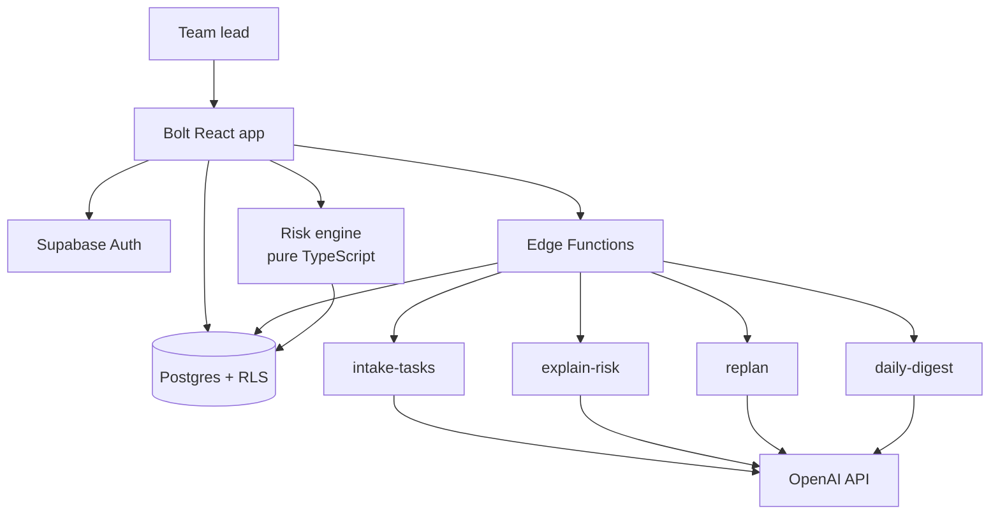

# Hackathon Build Plan — Task Management App

**40 hours · 6 people · AI Generalist Accelerator**

Sep 25, 2026 · @Zaheer Abbas

## Bottom line

Build a task board with a **Delivery Risk Radar and one-click Replan** on top of it. Ship it with Bolt.new + Supabase + OpenAI Edge Functions in 40 hours, with 6 people split across two front-end tracks, one data track, one AI track, one integration/QA track and one product/demo track.

The judging rubric has four criteria: understanding of the problem, end-to-end functionality, creativity ("a fresh take, not a template"), and presentation. A plain task manager scores well on functionality and badly on creativity, because several teams in the cohort will build one and the judges will see them back to back. Everything below is designed to fix that single weakness without widening the build.

**The angle.** A normal board tells you what exists. Yours tells you **what is going to slip, why, and what to do about it** — then rearranges the plan on one click.

1. The team dumps a messy plan (meeting notes, a paragraph, a list) and AI turns it into structured tasks with estimates, owners and dependencies.
2. A **Risk Score** is computed in code, not by the model: dependency chains, due dates, per-person load, and how long each task has been stuck.
3. A **Replan** button re-sequences the board — moves dates, rebalances owners, flags what must be cut — and the score visibly drops from red to green on stage.

**The demo moment (the whole pitch in 20 seconds).** Board looks calm → Risk panel says "Launch slips 3 days · 2 blocked · Priya at 140% load" → click Replan → cards move, dates shift, score goes 34 → 82. That is the one thing no other team's task app will have.

**How the 40 hours break down.**

| Block | Hours | Outcome |
| --- | --- | --- |
| Phase 0 — Lock scope | 0–4 | Idea frozen, PRD, data model, Bolt prompt, demo fixtures written |
| Phase 1 — Skeleton | 4–14 | Auth, schema, RLS, board CRUD working on real data |
| Phase 2 — The differentiator | 14–26 | AI intake, risk scoring, Replan — the score renders live |
| Phase 3 — Harden | 26–34 | Full CRUD pass, error states, three clean end-to-end runs |
| Phase 4 — Present | 34–40 | UI polish, seeded demo account, Loom, deck, submit |

**The three hard rules.** One end-to-end flow, not twenty features. The risk score is computed in application code so the number never wobbles between refreshes. Recording starts at hour 36, not hour 39 — an unsubmitted project scores zero.

## Scope: what to build and what to refuse

**Product name:** PlanPulse (or your own — pick it in hour 1 and stop discussing it).

**One-liner.** For small delivery teams of 5–15 people, PlanPulse is a task board that predicts which work is about to slip and re-plans the week in one click, so a team lead stops finding out about a delay in the standup after it already happened.

**Primary user.** A team lead or project manager running 8–20 live tasks across 4–8 people, who currently maintains the real plan in their head and a spreadsheet.

**Top three pains.**

1. The board shows status but not risk — a task marked "In progress" for nine days looks identical to one started this morning.
2. When one thing slips, nobody re-sequences everything downstream, so the slip is discovered at the deadline.
3. Load is invisible: one person is drowning and two are idle, and the board gives no signal.

**Final problem statement.** Team leads discover slippage only after it has happened, because task boards record status but never compute risk — so every delay costs a re-planning scramble that nobody has time to do properly.

### MoSCoW scope

| Feature | Priority | Edge? |
| --- | --- | --- |
| Auth, projects, task CRUD, Kanban board with drag-and-drop | Must | – |
| Assignees, due dates, estimates, status, dependencies | Must | – |
| **AI Intake** — paste messy notes, get structured tasks with estimates and dependencies | Must | ⭐ |
| **Risk Radar** — per-task risk + project health score, computed in code | Must | ⭐ |
| **One-Click Replan** — re-sequence dates, rebalance owners, propose cuts | Must | ⭐ |
| **Why-it's-risky** — one plain-English line per flagged task | Should | ⭐ |
| Daily digest text the lead can paste into Slack | Should | – |
| Comments, attachments, real-time multiplayer, notifications, mobile app, time tracking, Gantt | Won't | – |

### How each feature earns a judging criterion

| Criterion | What the judge asks | What answers it here |
| --- | --- | --- |
| 01 Understanding | Who is it for and why does it hurt? | The standup story: "we found out on Thursday that Monday's task never started" |
| 02 Functionality | Does it work end to end? | Create project → AI intake → board → risk → replan, run twice live with full CRUD |
| 03 Creativity | A fresh take, not a template | Risk scoring + replan. No other task board in the room will compute anything |
| 04 Presentation | UI and storytelling | A health dial that moves 34 → 82 on camera, on a clean two-colour UI |

### The refusal list

These will be suggested by someone on your team around hour 20. The answer is no, for all of them: real-time collaborative editing, WebSocket presence, email or push notifications, file uploads, a calendar view, a Gantt chart, time tracking, custom fields, dark-mode toggle, a mobile app, integrations with Jira or Slack (a copyable digest is not an integration — that one is allowed).

Each of these costs 3–6 hours and earns nothing on the rubric. Write this list on a wall.

## Tech stack

**Recommended: Bolt.new (React + Tailwind) + Supabase + OpenAI via Supabase Edge Functions.** This is the stack the accelerator playbook assumes, which matters more than any technical merit — a hackathon is the worst possible place to debug an unfamiliar toolchain.

| Layer | Choice | Why this one in 40 hours |
| --- | --- | --- |
| Front end | [Bolt.new](https://bolt.new) — React + Tailwind + Vite | Generates a working four-screen app from one prompt; you edit, not scaffold. [Lovable](https://lovable.dev) is an equal alternative — pick by whoever on the team has used one before |
| Database + auth | [Supabase](https://supabase.com) | Postgres, auth, storage and row-level security in one console; Bolt has first-class support for it |
| AI calls | Supabase Edge Functions calling the OpenAI API | Keeps the API key server-side. The front end must never call OpenAI directly |
| Drag-and-drop | `@dnd-kit/core` | Lighter and less fragile than react-beautiful-dnd; one afternoon to wire |
| Hosting | Bolt's own deploy, or [Vercel](https://vercel.com) | Either gives you a public URL for the submission. Deploy on day one, not at hour 38 |
| Code backup | One private GitHub repo, one branch, one code owner | Per the playbook. Commit only working code |

### What to avoid

- **A custom backend** (Express, FastAPI, Django). You will spend 6 hours on auth alone. Supabase gives you auth, database and RLS in 45 minutes.
- **n8n for the AI steps.** Tempting because it is in your toolkit, but it adds a network hop, a second failure point and a service you must keep awake during the demo. Edge Functions are one file each.
- **A vector database or RAG.** There is nothing to retrieve. Your AI calls are stateless transformations of text the user just pasted.
- **Real-time subscriptions.** Supabase makes this easy, which is exactly the trap — it will eat four hours for something no judge will notice.
- **Mixing tools per person.** Six people on three scaffolds cannot merge. One repo, one stack, one deploy target, agreed in hour 1.

### AI model choice

Use one model for everything and set `response_format: { type: "json_object" }` on every call. A cheap fast model is right for intake and explanations; reserve the stronger model only for the replan call if quality is visibly worse. Validate every response against an expected shape **before** writing to Postgres — a malformed JSON response that reaches the UI is the single most common way a hackathon demo dies on stage.

### Environment setup, hour 0

All six people do this before any code is written:

- [ ] GitHub repo created, everyone added with write access
- [ ] Supabase project created, database URL and anon key shared in a pinned message
- [ ] OpenAI key in Supabase secrets — never in front-end code, never in the repo
- [ ] A second OpenAI key held in reserve by the integration lead
- [ ] One shared doc with the schema, so nobody invents a different column name

## Architecture

Four screens, six tables, four Edge Functions. Nothing else.



The rule that keeps this safe: **the risk score is computed by the risk engine in plain TypeScript, never by the model.** The LLM writes the explanation sentence; the arithmetic is yours. A number that changes between two refreshes destroys the differentiator in front of a judge.

### Data model

| Table | Key fields | Notes |
| --- | --- | --- |
| `profiles` | id, user\_id, full\_name, capacity\_hours\_per\_week | Capacity defaults to 30 — needed for load calculation |
| `projects` | id, owner\_id, name, start\_date, target\_date | One project = one board |
| `tasks` | id, project\_id, title, description, status, assignee\_id, estimate\_hours, due\_date, started\_at, priority, risk\_score, risk\_reason, order\_index | The core table — everything hangs off it |
| `dependencies` | id, task\_id, blocks\_task\_id | A task blocking another. Simple edge list, no graph library |
| `replans` | id, project\_id, before\_score, after\_score, changes\_json, created\_at | Stores the before/after so the demo survives a refresh |
| `digests` | id, project\_id, body, created\_at | The Slack-pasteable summary |

`risk_score` and the project health score are **stored**, not computed on render. Recompute them on every write, so a page refresh mid-demo shows the same number.

### Screens

| Screen | Key actions | What it shows |
| --- | --- | --- |
| Dashboard | Create project, open, delete | Project cards with health score, task count, target date |
| Intake | Paste notes, review parsed tasks, accept | Draft tasks with editable title, owner, estimate, dependency |
| Board | Drag between columns, add, edit, delete task, open risk panel | Kanban with risk colour on each card |
| Risk Radar | View ranked risks, click Replan, view before/after | Health dial, ranked risk list, per-person load bars |

The Risk Radar can be a right-hand panel on the Board rather than a separate route — that reads better in a demo, because the board and the score are visible at the same moment.

### The four Edge Functions

| Function | Input | Output | Called from |
| --- | --- | --- | --- |
| `intake-tasks` | Raw pasted text, list of team members | JSON array of tasks: title, description, estimate\_hours, suggested\_assignee, depends\_on (by title) | Intake screen |
| `explain-risk` | Task row + its computed risk factors | One sentence: why this task is risky | Board, on risk panel open |
| `replan` | All tasks, dependencies, capacities, target date | Proposed new due dates, reassignments, and tasks to cut, with a one-line rationale each | Replan button |
| `daily-digest` | Tasks changed in last 24h + top risks | A short paste-ready standup summary | Digest button |

### The risk engine

This is about 60 lines of TypeScript and it is the most valuable code in the project. Each task scores 0–100, higher is worse:

```latex
R = 30 \cdot S + 25 \cdot B + 25 \cdot L + 20 \cdot D
```

| Factor | Meaning | How it is computed |
| --- | --- | --- |
| `S` Staleness | How long a task has sat in one status | `days_in_status / estimate_days`, capped at 1 |
| `B` Blocked depth | How much work waits behind it | `count(downstream tasks) / total tasks`, capped at 1 |
| `L` Owner overload | Whether its assignee is over capacity | `max(0, assigned_hours / capacity - 1)`, capped at 1 |
| `D` Deadline pressure | Whether remaining work fits the time left | `max(0, 1 - days_left / estimate_days)`, capped at 1 |

**Project health** = `100 - weighted average of task risk`, weighted by estimate hours. Show it as a dial with three bands: red under 50, amber 50–75, green above 75.

**Replan** re-sequences in code first — topological sort on dependencies, then greedy assignment to the least-loaded person with capacity — and uses the LLM only to write the human rationale for each change. Code proposes, model narrates. That order is what keeps the demo stable.

## Team of six

Six people on one small app is more people than the work needs, which is a real risk: idle hands add features. Give everyone a lane that ends in a deliverable nobody else touches.

| # | Role | Owns | Deliverable by hour 26 |
| --- | --- | --- | --- |
| 1 | Product & demo lead | PRD, scope defence, fixtures, Loom, pitch deck | Demo script written and rehearsed |
| 2 | Data & platform | Supabase schema, RLS, auth, seed data, deploy | Schema live, RLS tested with two accounts |
| 3 | Front end A — board | Board, task CRUD, drag-and-drop, task modal | Board fully working on real data |
| 4 | Front end B — risk UI | Risk panel, health dial, load bars, replan diff view, all polish | Risk panel rendering real scores |
| 5 | AI engineer | All four Edge Functions, prompts, JSON validation | `intake-tasks` and `replan` returning valid JSON |
| 6 | Integration & QA | Risk engine code, git ownership, the test loop, bug log | Risk engine unit-tested, end-to-end run green |

Given your testing background, take role 6 or role 1 — both are the roles where an 11-year QA instinct is worth the most. Role 6 owns the only thing that reliably kills hackathon teams: nobody running the whole flow end to end until it is too late.

### The contracts to agree in hour 1

These four decisions unblock everyone to work in parallel. Write them down before anyone opens an editor.

1. **The schema.** Exact table and column names, frozen. Front end A, front end B and the AI engineer all code against it without waiting for the database to exist.
2. **The Edge Function JSON shapes.** Write the request and response shape for all four functions as literal example JSON. The front end builds against mocked responses from hour 4; the AI engineer makes reality match the mock.
3. **The risk engine signature.** `computeRisk(tasks, dependencies, profiles) => { taskScores, healthScore }` — pure function, no database calls. Front end B renders it, QA tests it, and neither waits for the other.
4. **Who merges.** One code owner. Small commits of working code only. Nobody pushes to main at hour 39.

### Working rhythm

- **Standup every 4 hours, 10 minutes, standing up.** What's done, what's blocked, what you'll finish next block.
- **Nobody works alone on the critical path.** The intake → board → risk → replan chain is the product. If one person on it stalls for an hour, someone pairs with them.
- **A rota for rest.** Six people over 40 hours means two can be asleep at any time. A team that all sleeps at hour 30 loses hours 30–36, which are the polish hours that win criterion 04.

## The 40-hour timeline

Hours are elapsed team hours, not calendar. Shift them to your own window but keep the ordering and the gates.

### Hours 0–4 — Lock scope

Everybody together, no code.

- Freeze the idea and the name. No revisiting after hour 4, whatever anyone suggests at hour 22.
- Fill workbook Steps 1–4: one-liner, user, pains, 5 Whys, MoSCoW. Criterion 01 is literally scored on this.
- Competitor scan — screenshot Trello, Asana and Linear. Two things each does well, two that frustrate. Twenty minutes, not two hours.
- Write the schema, the four JSON contracts, and the risk formula on a shared doc.
- Write the Bolt starting prompt: entities, screens, data model, must-have flow, in one paste.
- **Write the demo fixtures now.** A realistic project with 14 tasks, 5 people, two blocked chains and one overloaded person. This is the hardest thing to invent at hour 38 and the easiest now.

### Hours 4–14 — Skeleton on real data

| Owner | Work |
| --- | --- |
| Data & platform | Supabase project, all 6 tables, RLS on every table, auth, seed script for the fixture |
| Front end A | Paste the Bolt prompt, accept generation 1 as a skeleton, wire dashboard + board to real Supabase data |
| Front end B | Task modal, then the static risk panel against mocked scores |
| AI engineer | `intake-tasks` function, tested with curl before any UI exists |
| Integration & QA | Risk engine as a pure function with unit tests; repo, branch rules, first deploy |
| Product | PRD, demo script v1, pitch deck skeleton |

**Gate at hour 14: you can create a project, add a task, drag it between columns, and it persists.** If not, cut AI intake entirely and let users type tasks — the board must exist.

### Hours 14–26 — The differentiator

- Wire `intake-tasks` to the Intake screen with an editable review step before saving.
- Connect the risk engine to real task data; recompute and store on every write.
- Render the health dial and ranked risk list from stored scores.
- Build `replan`: topological sort and greedy reassignment in code, LLM for the rationale.
- Build the before/after view — the replan diff is the demo's climax, so it gets real design time.
- `explain-risk` last; it is the cheapest of the four.

**Gate at hour 26: the health score renders from real data and the replan button changes the board.** If not, cut replan and demo the Risk Radar alone — still a differentiated product.

### Hours 26–34 — Harden

- Full CRUD pass on every entity. Every dead button is a direct hit on criterion 02.
- Error and loading states on all four AI calls: spinner, timeout message, retry. A hung spinner on stage reads as a broken app.
- Empty states on every screen — a fresh account must not show a blank white page.
- Run the full scenario end to end three times with the fixtures. Log every bug in a table, fix with targeted prompts, retest.
- Test with a second account to catch RLS mistakes. Do this by hour 30, not hour 39.

**Gate at hour 34: the full flow runs twice in a row without a crash.** If not, freeze all features and spend everything remaining on stability.

### Hours 34–40 — Present

| Hours | Work |
| --- | --- |
| 34–36 | UI pass: one accent colour, consistent spacing, one font, real empty states. Seed the polished demo account |
| 36–38 | Record the Loom. Expect three takes. Close every other tab |
| 38–39 | Pitch deck on the provided template, live link verified from a different device |
| 39–40 | Submit through the portal. Buffer for the thing that always goes wrong |

### Gates in one table

| Hour | Must be true | If it isn't |
| --- | --- | --- |
| 4 | Scope frozen, schema and contracts written | Decide by coin toss and move on |
| 14 | Board CRUD works on real data | Cut AI intake, type tasks manually |
| 26 | Health score renders, replan changes the board | Ship the Risk Radar without replan |
| 34 | Full flow runs twice, no crash | Feature freeze, stability only |
| 38 | Loom recorded | Record what works, narrate around the gaps |
| 40 | Submitted | Submit the imperfect version — unsubmitted scores zero |

## Task backlog

Paste these into whatever tracker you use — including your own app, once it works, which makes a nice line in the pitch.

### Product & demo lead

- [ ] Workbook Steps 1–4 filled: one-liner, user, pains, 5 Whys, MoSCoW
- [ ] Competitor scan: Trello, Asana, Linear — two strengths, two frustrations each
- [ ] Demo fixture written: 14 tasks, 5 people, 2 blocked chains, 1 overloaded person
- [ ] Bolt starting prompt drafted from the PRD
- [ ] Demo script v1 by hour 14, rehearsed by hour 30
- [ ] Pitch deck on the provided template
- [ ] Loom recorded, three takes, by hour 38
- [ ] Portal submission with link, video, deck, team details

### Data & platform

- [ ] Supabase project, keys shared in a pinned message
- [ ] Six tables created exactly as the frozen schema says
- [ ] RLS policy on every table, verified with a second account
- [ ] Auth: email sign-up, sign-in, sign-out
- [ ] Seed script that loads the demo fixture in one command
- [ ] Deploy pipeline live by hour 10, public URL shared
- [ ] Demo account seeded and polished by hour 34

### Front end A — board

- [ ] Bolt generation 1 from the starting prompt
- [ ] Dashboard: list, create, open, delete projects
- [ ] Board: four columns, tasks render from Supabase
- [ ] Drag-and-drop between columns, persists status and order
- [ ] Task modal: create, edit, delete, assignee, estimate, due date, priority
- [ ] Dependency picker: mark a task as blocking another
- [ ] Empty states for no projects and no tasks

### Front end B — risk UI

- [ ] Risk panel shell against mocked scores by hour 10
- [ ] Health dial with three colour bands
- [ ] Ranked risk list, worst first, with the explanation line
- [ ] Per-person load bars showing over-capacity in red
- [ ] Risk colour on each board card
- [ ] Replan diff view: before and after, changes highlighted
- [ ] Replan confirm and undo
- [ ] Final UI polish pass, hours 34–36

### AI engineer

- [ ] `intake-tasks`: raw notes → structured task JSON
- [ ] JSON schema validation on every response, with a safe fallback
- [ ] `explain-risk`: risk factors → one plain sentence
- [ ] `replan`: code-proposed changes → human rationale per change
- [ ] `daily-digest`: recent changes + top risks → paste-ready summary
- [ ] All four tested with curl before any UI wiring
- [ ] Cached fallback response for each function, for the demo

### Integration & QA

- [ ] Risk engine as a pure function, with unit tests on the four factors
- [ ] Repo, branch protection, merge ownership
- [ ] End-to-end scenario script written by hour 12
- [ ] Bug log table: issue, screen, fix prompt, fixed Y/N
- [ ] Three clean end-to-end runs by hour 34
- [ ] Second-account RLS test by hour 30
- [ ] Cross-browser check and a phone-width check
- [ ] Final pre-submission checklist run

## Demo and submission

The Loom is 2–3 minutes and judges may score you from it alone. Treat it as worth more than one extra feature, because it is.

| Time | Beat | On screen | Criterion |
| --- | --- | --- | --- |
| 0:00–0:25 | The problem as one person's story | Your face or a still — not the app | 01 |
| 0:25–0:50 | Paste messy meeting notes, watch them become a board | Intake screen | 02, 03 |
| 0:50–1:25 | Health score lands at 34. Two blocked chains, one person at 140% | Board + Risk Radar | 01, 03 |
| 1:25–2:10 | Click Replan. Dates shift, work rebalances, score climbs to 82 | Replan diff | 02, 03 |
| 2:10–2:35 | Copy the digest, paste it as a standup update | Digest | 02 |
| 2:35–2:50 | What's next, one sentence | Dashboard | 04 |

**Open with the story, not the stack.** Something like: *"Last quarter my team missed a deadline by nine days. The board said everything was 'in progress'. It had said that for three weeks. Nobody was lying — the board just had no way to tell us we were in trouble."* That answers criterion 01 in fifteen seconds and is worth more than any feature you could show instead.

**Say the differentiator out loud.** Judges watch many similar demos and will not infer it. Name it: *"Every task app tracks status. This one computes risk — and then fixes the plan for you."*

**Rules for the recording.**

- Use the seeded demo account. Nothing on screen may be empty.
- Close every other tab and notification.
- Never say "this part is a bit broken". Show only what works.
- If an AI call is slow, cut the dead air in Loom rather than narrating over a spinner.
- Re-record until there is no apology anywhere in it.

**The README and deck.** Both need the same three things in the first ten seconds: who it is for, what hurts, and the one mechanic that is different. Judges skim. Put the before/after score screenshot at the top.

**Submission checklist.** Live product link, Loom video, pitch deck on the provided template, team details, submitted through the portal only — anything sent by WhatsApp or email does not count. Verify the live link from a device that has never logged in, in an incognito window, before you submit.

## Risks and first-hour decisions

| Risk | Likelihood | Impact | Mitigation |
| --- | --- | --- | --- |
| Judged as "another Trello clone" | High | Loses criterion 03 outright | The risk score and replan must be on screen within 45 seconds of the demo starting |
| Six people, merge chaos | High | Days lost to conflicts | One repo, one code owner, small commits of working code only |
| Scope creep into notifications or real-time | High | Nothing finishes | The refusal list, written on a wall, re-read at hour 26 |
| LLM returns malformed JSON | High | Screens crash mid-demo | Strict JSON mode, server-side validation, cached fallback response per function |
| Drag-and-drop eats a day | Medium | Board unfinished | Use `@dnd-kit`, timebox to 4 hours, fall back to a status dropdown |
| Risk score wobbles between refreshes | Medium | Destroys the differentiator | Compute in code, store the result, never recompute on render |
| RLS blocks reads in production | Medium | Works locally, fails live | Second-account test by hour 30 |
| AI latency makes the demo drag | Medium | Hurts criterion 04 | Pre-warm the demo session, show real progress states, cut dead air in the recording |
| OpenAI key or quota fails | Low | Total failure | Second key held in reserve, plus one recorded clean run as insurance |

### Cut order, if time runs short

Drop in this sequence and no other:

1. Daily digest
2. `explain-risk` sentences (show the raw factors instead)
3. AI intake (let users type tasks)
4. Replan

The board and the risk score are never cut. They are the product.

### Decide these in hour 1

- [ ] Bolt or Lovable — whoever has used one before wins the argument
- [ ] Product name, final
- [ ] Who takes each of the six roles
- [ ] The exact schema, written down
- [ ] The four Edge Function JSON shapes, written as example payloads
- [ ] Who is the single code owner
- [ ] The sleep rota

### The one thing that loses this hackathon

Arriving at hour 39 with five half-finished screens and no recording. A narrower app that works, recorded calmly, beats a broader one every time — the rubric puts end-to-end function and presentation at half the total score, and both of those are decided in the last six hours you have left.
