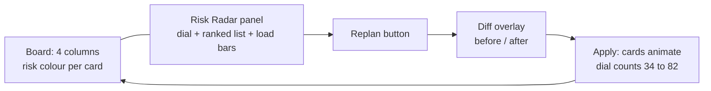
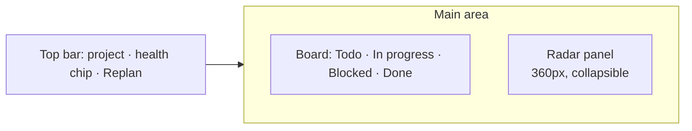
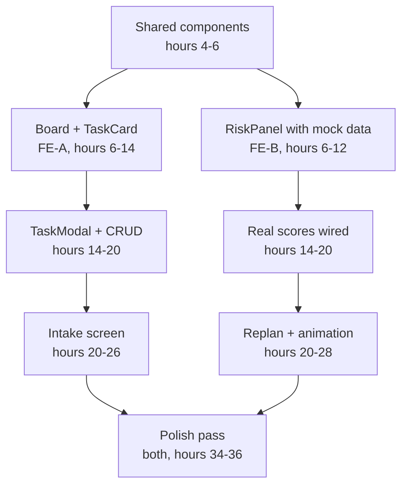

# Frontend Architecture — PlanPulse

**Bolt + shadcn/ui + Tailwind · dark mission-control · animated replan**

Sep 25, 2026 · @Zaheer Abbas

## Bottom line

Five screens, one of which is the product. Build the four ordinary screens fast and cheap with Bolt, then spend your best front-end hours on the Risk Radar, because that is the only screen a judge will remember.

### The four decisions

| Decision | Choice | Consequence |
| --- | --- | --- |
| Build method | Bolt generates, team edits | First working screen inside hour 5. Accept generation 1 as a skeleton and do not fight its styling until hour 34 |
| Components | shadcn/ui on Tailwind | You own the component source, so restyling to the dark theme is editing your own files, not overriding a library |
| Visual direction | Dark mission-control, one electric accent | Reads as an operations tool, not a to-do app. Projects brilliantly in a dim room |
| Motion | Framer Motion layout animation on replan | \~3 hours, buys the single most memorable second of the demo |

### What the UI has to do for each criterion

The rubric is four equal quarters, and the front end is directly responsible for two of them.

| Criterion | What the UI must achieve |
| --- | --- |
| 01 Understanding | The board shows risk, not just status — a judge should see "this is in trouble" without anyone explaining |
| 02 Functionality | No dead buttons, no blank states, no hung spinners. Every entity fully CRUD-able |
| 03 Creativity | The Risk Radar and the animated replan. Nothing else in the app is novel, and nothing else needs to be |
| 04 Presentation | One accent colour, one type scale, consistent spacing, and motion that reads as deliberate |

### The screen that wins it

The Risk Radar is not a separate route. It is a right-hand panel on the board, so the score and the cards it describes are on screen together. That single layout decision is worth more than any feature, because it makes the cause and the consequence visible in one frame — the judge sees the red cards *and* the number at the same moment, and then watches both change.



### The 60-second rule

Everything above serves one constraint: **within 60 seconds of the demo starting, a judge must have seen the health score, understood that it means trouble, and watched it change.** Any front-end work that does not shorten that path is polish, and polish happens after hour 34.

## Design system

One accent, one neutral ramp, one semantic risk scale. Six people cannot improvise a coherent look — paste these tokens into `index.css` in hour 5 and nobody argues about colour again.

### Colour tokens

```css
:root {
  /* surfaces — dark slate, never pure black */
  --bg:            #0B0F17;   /* page */
  --surface:       #141A24;   /* cards, panels */
  --surface-2:     #1C2431;   /* raised: modals, hovered cards */
  --border:        #263141;
  --border-strong: #35435A;

  /* text */
  --text:          #E8EDF5;
  --text-muted:    #94A3B8;
  --text-faint:    #64748B;

  /* the one accent — used for primary action and the healthy dial only */
  --accent:        #4F8CFF;
  --accent-hover:  #6BA0FF;
  --accent-soft:   #4F8CFF1A;

  /* risk scale — the app's real colour language */
  --risk-none:     #3FBF8F;   /* 0-24   healthy */
  --risk-low:      #7DD3A0;   /* 25-44  watch */
  --risk-med:      #F0B429;   /* 45-64  at risk */
  --risk-high:     #F97316;   /* 65-84  critical */
  --risk-severe:   #EF4444;   /* 85-100 blocking */

  --radius:        10px;
  --radius-lg:     14px;
}
```

The discipline that makes this look designed rather than assembled: **the accent blue is used only for primary buttons and the healthy end of the dial.** Every other colour on screen is either neutral or a risk colour. When a judge sees orange, it always means the same thing.

### The risk colour language

| Band | Score | Colour | Used on |
| --- | --- | --- | --- |
| Healthy | 0–24 | `--risk-none` | Card left border, dial arc, load bar |
| Watch | 25–44 | `--risk-low` | Same |
| At risk | 45–64 | `--risk-med` | Same, plus a small dot on the card |
| Critical | 65–84 | `--risk-high` | Same, plus the card ranks into the radar list |
| Blocking | 85–100 | `--risk-severe` | Same, plus a subtle pulse on the card border |

One helper function, used everywhere, so the mapping can never drift between components:

```ts
export const riskBand = (s: number) =>
  s >= 85 ? 'severe' : s >= 65 ? 'high' : s >= 45 ? 'med' : s >= 25 ? 'low' : 'none';

export const riskColor = (s: number) => `var(--risk-${riskBand(s)})`;
```

Project health inverts the scale — high health is good — so the dial uses `riskColor(100 - health)`. Write that once, in the dial component, and never anywhere else.

### Type

One font family, five sizes. Inter is the safe choice and is already on Google Fonts; `JetBrains Mono` only for the score numerals, where tabular figures stop the digits jittering as they count up.

| Token | Size / weight | Used on |
| --- | --- | --- |
| `display` | 48px / 600, tabular | The health score numeral |
| `h1` | 24px / 600 | Page titles |
| `h2` | 18px / 600 | Panel and section headers |
| `body` | 14px / 400 | Everything |
| `label` | 12px / 500, +0.02em tracking, uppercase | Column headers, metadata, badges |

```css
body { font-family: 'Inter', system-ui, sans-serif; font-size: 14px; }
.numeral { font-family: 'JetBrains Mono', monospace; font-variant-numeric: tabular-nums; }
```

`tabular-nums` on the score is not a detail. Without it, the width of the number changes as it animates from 34 to 82 and the whole dial visibly wobbles on camera.

### Spacing and elevation

Tailwind's 4px scale, restricted to six steps: `1, 2, 3, 4, 6, 8` (4px to 32px). Nothing else. Cards get `p-4`, panels `p-6`, the gap between board columns is `gap-4`.

Elevation is carried by surface colour, not by shadow — shadows read as muddy on dark backgrounds. A raised element steps from `--surface` to `--surface-2` and gains a `--border-strong` outline. The only real shadow in the app is on the dragged card and the modal overlay.

### Motion tokens

| Token | Duration | Easing | Used on |
| --- | --- | --- | --- |
| `quick` | 120ms | `ease-out` | Hover, focus, button press |
| `base` | 220ms | `ease-out` | Panel open, card enter |
| `move` | 420ms | `cubic-bezier(.2,.8,.2,1)` | Cards relocating during replan |
| `count` | 1200ms | `ease-out` | The score counting up |

Everything respects `prefers-reduced-motion` — five lines, and it is the kind of detail a technical judge notices.

```css
@media (prefers-reduced-motion: reduce) {
  *, *::before, *::after { animation-duration: .01ms !important; transition-duration: .01ms !important; }
}
```

## Stack and structure

### Dependencies

Nine libraries. Every one earns its place; adding a tenth needs an argument.

| Package | Purpose | Why this one |
| --- | --- | --- |
| `react` + `vite` + `typescript` | Base | What Bolt generates. Do not fight it |
| `tailwindcss` | Styling | Already in the Bolt output |
| `shadcn/ui` | Components | Copy-paste source you own. Restyle by editing, not overriding |
| `@supabase/supabase-js` | Data + auth | One client, typed from generated types |
| `@tanstack/react-query` | Server state | Caching, refetch, optimistic updates. The single most valuable dependency here |
| `@dnd-kit/core` + `sortable` | Drag-and-drop | Lighter and more predictable than the alternatives |
| `framer-motion` | The replan animation | `layoutId` does the card-flight animation almost for free |
| `react-router-dom` | Routing | Five routes, nothing clever |
| `date-fns` | Dates | `formatDistanceToNow` gives you "9 days ago" in one call |
| `lucide-react` | Icons | Ships with shadcn |

No state management library. TanStack Query holds server state, `useState` holds UI state, and there is no third category in an app this size. Redux or Zustand here is a solution to a problem you do not have.

No charting library for the dial — it is an SVG arc, forty lines, and a library would be heavier and less controllable. Add `recharts` only if you build the snapshot trend chart, and only after hour 34.

### Setup commands

```bash
npx shadcn@latest init
npx shadcn@latest add button card dialog input select badge \
  dropdown-menu tabs avatar textarea sonner skeleton tooltip

npm i @supabase/supabase-js @tanstack/react-query \
  @dnd-kit/core @dnd-kit/sortable framer-motion date-fns

npx supabase gen types typescript --project-id <id> > src/types/db.ts
```

That last command is worth its own line in the standup. Generated database types mean a renamed column becomes a TypeScript error at build time rather than an empty panel at hour 37.

### Folder structure

```
src/
  app/
    routes.tsx              # all five routes
    providers.tsx           # QueryClient, Supabase, Toaster
  screens/
    Auth.tsx
    Dashboard.tsx
    Intake.tsx
    Board.tsx               # owns the board + radar layout
    Settings.tsx            # members, capacities, invites
  features/
    board/                  # FE-A owns this folder entirely
      TaskCard.tsx  Column.tsx  TaskModal.tsx  useBoardDnd.ts
    radar/                  # FE-B owns this folder entirely
      RiskPanel.tsx  HealthDial.tsx  RiskList.tsx  LoadBars.tsx
      ReplanDialog.tsx  ReplanDiff.tsx  useReplan.ts
    intake/
      PasteBox.tsx  DraftTaskList.tsx
  components/ui/            # shadcn output, shared, edit with care
  lib/
    supabase.ts  queries.ts  mutations.ts  risk.ts  format.ts
  types/db.ts               # generated, never hand-edited
```

The folder boundary is the merge-conflict strategy. `features/board` and `features/radar` are owned by one person each, and neither touches the other's folder. Everything they share goes through `lib/` and `components/ui/`, which change rarely and are reviewed by the code owner.

### The Supabase client

```ts
// lib/supabase.ts
import { createClient } from '@supabase/supabase-js';
import type { Database } from '@/types/db';

export const supabase = createClient<Database>(
  import.meta.env.VITE_SUPABASE_URL,
  import.meta.env.VITE_SUPABASE_ANON_KEY
);
```

Only the **anon key** goes in `VITE_` variables — anything prefixed `VITE_` is compiled into the bundle and visible to anyone who opens devtools. The service role key lives in Supabase secrets and is used only inside Edge Functions. Put a comment saying exactly that above these lines, because at hour 30 someone will be tempted.

### Environment

```bash
VITE_SUPABASE_URL=https://xxxx.supabase.co
VITE_SUPABASE_ANON_KEY=eyJhb...
```

Commit a `.env.example` with these keys and empty values, and put `.env` in `.gitignore` in hour 5. A leaked key at hour 38 is a bad hour 38.

## Screens

Five routes. Nothing nested deeper than one level.

| Route | Screen | Owner |
| --- | --- | --- |
| `/auth` | Sign in / sign up | FE-A |
| `/` | Dashboard — project list | FE-A |
| `/p/:id/intake` | Intake — paste to tasks | FE-A |
| `/p/:id` | Board + Risk Radar | FE-A board, FE-B radar |
| `/settings` | Members, capacities, invites | FE-B |

### The shell

A fixed 56px top bar and nothing else. No sidebar — with five routes a sidebar is empty furniture that eats 240px of the width the board needs. The top bar holds: product mark on the left, current project name as a dropdown in the centre-left, and the user avatar menu on the right.

### `/auth`

Email and password, one card, centred, with the product name and the one-line pitch above it. Twenty minutes of work, and it is the first thing a judge sees when they open your link — so the tagline goes here, not just on the deck.

Add a **"View the demo board"** button that signs in to the seeded account. Judges will not create an account, and a project they cannot enter scores nothing on functionality.

### `/` Dashboard

A grid of project cards, each showing: name, a small health dial, task count, days to target, and a row of assignee avatars. The card's left border carries the health colour, so the grid reads at a glance.

Empty state matters here because it is the first authenticated screen: a short line, an illustration or large icon, and one primary button. Never a blank area with a floating "+".

### `/p/:id/intake`

Two panes. Left: a large textarea with a real placeholder showing messy meeting notes, plus a **"Use sample notes"** button that fills it instantly — that button is a demo-saver when the clock is running.

Right: the parsed draft, appearing as cards with editable title, estimate, assignee and detected dependency. Nothing is written to the database until **Accept all**. Show which fields the AI inferred with a small sparkle icon, so the user knows what to check.

The parse takes several seconds. Fill that time with a real progress sequence — "Reading notes… / Finding tasks… / Estimating effort… / Detecting dependencies…" — stepping every 900ms. A labelled wait feels like work being done; a bare spinner feels like a hang.

### `/p/:id` Board + Radar — the main screen



Layout: board flexes, radar panel is a fixed 360px on the right, collapsible to 0 with a keyboard shortcut. Below 1024px the panel becomes a bottom sheet.

**The task card** is where most of the design value sits. It carries, in this order: a 3px left border in the risk colour, the title, a metadata row (avatar, estimate, due date), and — only when risk is 65+ — a single-line risk reason in muted text. A card at 85+ gets a slow border pulse.

Keep the card to two visual weights: title at `body` weight 500, everything else `label` in `--text-muted`. Cards that try to show six things all at the same weight are what makes a board look amateur.

**Column headers** show the status name in `label` style, a count, and nothing else. No per-column action buttons.

### `/settings`

A members table: avatar, name, role, capacity as an editable number input, and a remove action. Below it, an invite section that generates a link and copies it on click. Plain, functional, twenty minutes — but it is what makes the multi-user story real when a judge asks "can my team use this?"

### Keyboard shortcuts

Four of them, shown in a `?` overlay. They cost an hour and they make the app feel like a tool rather than a form.

| Key | Action |
| --- | --- |
| `N` | New task in the focused column |
| `R` | Open the replan dialog |
| `\` | Toggle the radar panel |
| `?` | Shortcut overlay |

## The Risk Radar and the Replan

This section is the product. Give it your strongest front-end person and protect their time.

### The panel, top to bottom

1. **The health dial** — an SVG arc, 140px, with the score as a large tabular numeral in the middle and a band label beneath it ("At risk"). The arc's colour comes from `riskColor(100 - health)`.
2. **Three stat chips** — blocked count, overloaded people, days to target. One line, `label` type.
3. **The ranked risk list** — the top five tasks by risk. Each row: score badge, title, one-line reason, assignee avatar. Clicking a row scrolls the board to that card and highlights it for 1.5s.
4. **Load bars** — one per member, a horizontal bar of assigned hours against capacity. Over-capacity portions render in `--risk-high` and extend past the 100% mark rather than clipping, so overload is visually obvious.
5. **The Replan button** — full width, primary accent, at the bottom of the panel where it reads as the conclusion of everything above it.

### The dial

```tsx
function HealthDial({ score }: { score: number }) {
  const R = 60, C = Math.PI * R;               // half-circle circumference
  const display = useCountUp(score, 1200);      // animates on change
  return (
    <svg viewBox="0 0 140 80" className="w-[140px]">
      <path d="M10 70 A60 60 0 0 1 130 70" fill="none"
            stroke="var(--border)" strokeWidth={10} strokeLinecap="round" />
      <motion.path d="M10 70 A60 60 0 0 1 130 70" fill="none"
            stroke={riskColor(100 - score)} strokeWidth={10} strokeLinecap="round"
            strokeDasharray={C}
            animate={{ strokeDashoffset: C - (C * score) / 100 }}
            transition={{ duration: 1.2, ease: 'easeOut' }} />
      <text x="70" y="64" textAnchor="middle"
            className="numeral fill-[var(--text)] text-[34px] font-semibold">
        {display}
      </text>
    </svg>
  );
}
```

The arc and the numeral must animate on the **same** duration and easing, or the number arrives before the arc and the effect looks broken.

### The replan sequence

This is the demo's climax. Six beats, about four seconds in total.

| Beat | Duration | What happens |
| --- | --- | --- |
| 1 | 0.3s | Button enters loading state: "Analysing 14 tasks…" |
| 2 | 1–3s | Edge Function runs. Skeleton rows appear in the diff panel |
| 3 | 0.4s | Diff overlay slides in: a list of proposed changes, each with its reason |
| 4 | — | User reads. **Apply** and **Discard** buttons. This pause is deliberate — it is where the narrator talks |
| 5 | 0.42s | On Apply: overlay fades, cards fly to new positions via `layoutId` |
| 6 | 1.2s | Dial arc sweeps and the numeral counts 34 → 82, finishing just after the cards land |

Beat 5 is three lines of Framer Motion, provided every card carries a stable `layoutId`:

```tsx
<motion.div layoutId={task.id}
  transition={{ duration: .42, ease: [.2,.8,.2,1] }}>
  <TaskCard task={task} />
</motion.div>
```

Wrap the board in `<LayoutGroup>`, re-render with the new task order, and Framer animates every card from where it was to where it now belongs. The card flight — the thing judges will describe to each other afterwards — is genuinely almost free, but **only** if `layoutId` is the task's database id and never an array index.

### The diff overlay

Each change row reads as a sentence, not as a data structure:

> **Checkout flow** · moved from Priya to Sneha *Priya is at 167% capacity; Sneha has 12 hours free this week*

Group the rows into "Reassigned", "Rescheduled" and "Suggested to cut". Put the score change at the top as a large before-and-after pair with an arrow between them, so the payoff is visible before the user has read a single row.

### The undo

After applying, a toast holds for eight seconds with an **Undo** action calling `revert_replan`. Two reasons it earns its keep: it lets you run the demo twice without reseeding, and undo on a destructive bulk action is the kind of thoughtfulness a technical judge registers immediately.

### Three details that carry more weight than their cost

**Stale time, stated plainly.** On any card sitting in one status beyond its estimate, show "9 days in progress" in `--risk-high`. One `formatDistanceToNow` call. It makes the core insight legible without anyone explaining it.

**The card pulse at 85+.** A 2s border opacity loop. Draws the eye to exactly the card the narrator is about to click.

**Number transitions everywhere.** Any score that changes should count rather than jump — in the dial, on the badges, in the stat chips. One `useCountUp` hook, used in three places, and the whole app feels alive rather than re-rendered.

## Data and state

### The rule

Server state lives in TanStack Query. UI state lives in `useState`. There is no third category, and no global store. If you find yourself wanting one, you are probably duplicating server state — don't.

### Query keys

One convention, written down, so two people never invalidate different keys for the same data.

```ts
export const keys = {
  projects:  ['projects'] as const,
  project:   (id: string) => ['project', id] as const,
  tasks:     (pid: string) => ['tasks', pid] as const,
  deps:      (pid: string) => ['deps', pid] as const,
  load:      (pid: string) => ['load', pid] as const,
  members:   (wid: string) => ['members', wid] as const,
  snapshots: (pid: string) => ['snapshots', pid] as const,
};
```

### The one query the board runs

Fetch tasks, dependencies and load in a single round trip rather than three, using Supabase's embedded selects. Three separate queries means three loading states resolving at different moments, and a board that visibly assembles itself.

```ts
export const useBoard = (pid: string) => useQuery({
  queryKey: keys.tasks(pid),
  queryFn: async () => {
    const { data, error } = await supabase
      .from('tasks')
      .select('*, assignee:workspace_members(id, display_name, capacity_hours)')
      .eq('project_id', pid)
      .is('deleted_at', null)
      .order('order_index');
    if (error) throw error;
    return data;
  },
  staleTime: 10_000,
});
```

### Optimistic drag-and-drop

A card that waits for a network round trip before moving feels broken. This is the highest-value optimistic update in the app and the only one that genuinely needs to be.

```ts
const move = useMutation({
  mutationFn: ({ id, status, order }: MoveArgs) =>
    supabase.from('tasks').update({ status, order_index: order }).eq('id', id),

  onMutate: async (vars) => {
    await qc.cancelQueries({ queryKey: keys.tasks(pid) });
    const prev = qc.getQueryData(keys.tasks(pid));
    qc.setQueryData(keys.tasks(pid), (old: Task[]) =>
      old.map(t => t.id === vars.id
        ? { ...t, status: vars.status, order_index: vars.order } : t));
    return { prev };
  },

  onError: (_e, _v, ctx) => {
    qc.setQueryData(keys.tasks(pid), ctx!.prev);
    toast.error('Could not move that task');
  },

  // the server recomputed risk — refetch to pick up new scores
  onSettled: () => {
    qc.invalidateQueries({ queryKey: keys.tasks(pid) });
    qc.invalidateQueries({ queryKey: keys.project(pid) });
  },
});
```

`onSettled` invalidating the **project** key as well as tasks is what makes the health dial update when a card moves. Miss it and the score goes stale without any visible error — a bug that is very hard to spot at 2am and very easy to spot on stage.

### Ordering between two cards

The `order_index` is a `numeric`, so a drop between two cards is the midpoint of its neighbours. No renumbering, no batch update.

```ts
const newOrder = (above?: Task, below?: Task) =>
  above && below ? (above.order_index + below.order_index) / 2
  : above ? above.order_index + 1000
  : below ? below.order_index - 1000
  : 1000;
```

### Realtime — and where to stop

Supabase realtime is tempting and mostly a trap here. Use it in exactly one place: **the board subscribes to its own project's task changes** so a second browser window updates live. That one subscription supports the "my whole team sees it" line in the pitch, and it is about fifteen lines.

```ts
useEffect(() => {
  const ch = supabase.channel(`tasks:${pid}`)
    .on('postgres_changes',
        { event: '*', schema: 'public', table: 'tasks', filter: `project_id=eq.${pid}` },
        () => qc.invalidateQueries({ queryKey: keys.tasks(pid) }))
    .subscribe();
  return () => { supabase.removeChannel(ch); };
}, [pid]);
```

Invalidate rather than patching the cache from the payload — patching is where the subtle bugs live, and at this scale a refetch is imperceptible.

Do **not** add realtime presence, cursors, or live editing indicators. They are three hours each and no judge scores them.

### Calling an Edge Function

```ts
const { data, error } = await supabase.functions.invoke('replan', {
  body: { project_id: pid, strategy: 'balance_load' },
});
```

The session token is attached automatically, which is what lets the function verify membership. Every function call gets a 30-second timeout and a user-visible failure path — never a promise that can hang forever behind a spinner.

### Auth

One `useAuth` hook wrapping `supabase.auth`, a `<ProtectedRoute>` that redirects to `/auth`, and an `onAuthStateChange` listener that clears the query cache on sign-out. Fifteen minutes, and skipping the cache clear means the next user to sign in on that browser briefly sees the previous user's board — which is a genuinely bad thing to happen during a judged demo.

## Component inventory

Thirty-one components. The **Owner** column is the merge-conflict strategy: two people never edit the same file, and the shared column is changed only by agreement.

### Shared — built first, by FE-B, in hours 4–6

Everything else depends on these, so they are built before either track starts on screens.

| Component | Notes |
| --- | --- |
| `AppShell` | Top bar, project switcher, avatar menu |
| `RiskBadge` | Score pill in its band colour. Used on cards, rows and chips |
| `Avatar` / `AvatarRow` | Initials fallback — nobody will upload a photo during a hackathon |
| `EmptyState` | Icon, headline, one line, one action. Used on six screens |
| `ErrorState` | Message plus Retry. Used wherever a query can fail |
| `LoadingSkeleton` | Card, row and panel variants |
| `useCountUp` | The number animation hook |
| `riskBand` / `riskColor` | In `lib/risk.ts`. Single source of the colour mapping |

### Front end A — board and CRUD

| Component | Priority | Notes |
| --- | --- | --- |
| `AuthCard` | Must | Sign in, sign up, and the demo-account button |
| `ProjectGrid` / `ProjectCard` | Must | Dashboard |
| `NewProjectDialog` | Must | Name, target date |
| `BoardColumn` | Must | Droppable, header with count |
| `TaskCard` | Must | The most-seen component in the app. Worth an extra hour |
| `TaskModal` | Must | Full CRUD: title, description, status, priority, assignee, estimate, due date, delete |
| `DependencyPicker` | Must | Searchable select of other tasks in the project |
| `useBoardDnd` | Must | dnd-kit sensors, drop handling, `order_index` maths |
| `PasteBox` | Must | Intake textarea, sample-notes button, progress sequence |
| `DraftTaskList` | Must | Editable AI drafts, accept-all |
| `ConfirmDialog` | Should | Reused by every delete |

### Front end B — radar, replan and polish

| Component | Priority | Notes |
| --- | --- | --- |
| `RiskPanel` | Must | The container: dial, chips, list, bars, button |
| `HealthDial` | Must | SVG arc plus count-up |
| `StatChips` | Must | Blocked, overloaded, days left |
| `RiskList` / `RiskRow` | Must | Top five, click to focus the card |
| `LoadBars` | Must | Capacity bars, over-capacity in red |
| `ReplanButton` | Must | Idle, loading and done states |
| `ReplanDiff` | Must | Grouped changes, before/after header |
| `ReplanApplyAnimation` | Must | `LayoutGroup` orchestration |
| `UndoToast` | Should | Eight-second window |
| `MembersTable` | Should | Settings: capacity editing |
| `InvitePanel` | Should | Generate and copy link |
| `DigestPanel` | Should | Generated text plus copy button |
| `ShortcutOverlay` | Could | The `?` dialog |
| `TrendChart` | Could | Snapshot history. Only after hour 34 |

### The build order that unblocks everyone



The critical detail: **FE-B builds the entire risk panel against hardcoded mock data from hour 6.** They do not wait for the risk engine, the Edge Functions, or even the database. When real scores arrive at hour 14, it is a one-line swap from a mock constant to a query hook. That parallelism is what makes six people faster than three rather than slower.

```ts
// features/radar/mockData.ts — delete at hour 14
export const MOCK_HEALTH = 34;
export const MOCK_RISKS = [
  { id: 't04', title: 'API authentication service', score: 91,
    reason: 'In progress 9 days, past due, 3 tasks blocked behind it' },
  // ...
];
```

Make the mock match the seed fixture exactly. Then the panel looks right from hour 6 onward, and any visual problem is found early rather than at hour 35.

## The states that lose points

Criterion 02 asks whether the app works end to end. In practice judges test that by clicking something unusual. Every gap below is a place where a hackathon app reveals that it was only ever driven down one path.

### Every async surface needs four states

Write them as one pattern and apply it everywhere, mechanically.

| State | What renders | Never |
| --- | --- | --- |
| Loading | Skeleton matching the real layout's shape | A centred spinner on a blank page |
| Empty | Icon, one-line explanation, one primary action | A blank area, or a bare "No data" |
| Error | What failed in plain words, plus Retry | A raw error object, or silence |
| Success | The content | — |

```tsx
if (isLoading) return <BoardSkeleton />;
if (error)     return <ErrorState msg="Couldn't load this board" onRetry={refetch} />;
if (!tasks.length) return <EmptyState ... />;
```

### The empty states, written out

These are worth writing properly because they are the first thing a judge sees when they create their own account rather than using your demo link.

| Screen | Headline | Action |
| --- | --- | --- |
| Dashboard | "No projects yet" | New project |
| Board | "This board is empty" | Paste your notes / Add a task |
| Intake draft | "Paste some notes to get started" | Use sample notes |
| Risk panel | "Nothing at risk — nice" | — |
| Members | "It's just you here" | Invite someone |

The risk panel's empty state deserves a moment: when health is above 90 the panel should say something warm rather than showing an empty list. It is a small thing that makes the app feel considered.

### AI calls specifically

The three Edge Function calls are the most likely things to fail on stage. Each needs:

- A labelled progress sequence, not a spinner — the steps described in the Intake screen spec.
- A 30-second timeout with a clear message: "That took too long. Try again?"
- A retry button that actually retries rather than reloading the page.
- Graceful degradation: if `explain-risk` fails, the panel still shows scores and factors, just without the sentence. No AI failure should ever blank a screen.

### Accessibility floor

Not for a certification — for the judge who tabs through your app, and because several of these also fix visual bugs.

- [ ] Every interactive element reachable by keyboard, with a visible focus ring in `--accent`
- [ ] dnd-kit's keyboard sensor enabled, so cards move without a mouse
- [ ] Text contrast at least 4.5:1 — check `--text-muted` on `--surface` specifically, it is the one that usually fails
- [ ] Risk is never communicated by colour alone: every card with a colour also carries a score number
- [ ] `aria-label` on icon-only buttons
- [ ] Modals trap focus and close on Escape — free with shadcn's Dialog
- [ ] `prefers-reduced-motion` respected

The colour-alone rule is the one that matters most here, and it is also just better design: a judge glancing at a projector may not distinguish your amber from your orange, but they can read "91".

### Performance floor

At 30 tasks nothing is slow, but three things still bite:

| Issue | Fix |
| --- | --- |
| Every card re-rendering on any drag | `React.memo` on `TaskCard`, compare by `id` and `updated_at` |
| Layout animation stuttering | Animate `transform` and `opacity` only — never `width`, `top` or `margin` |
| Slow first paint on the demo link | `React.lazy` the Settings and Intake routes; keep the board in the main bundle |

Run Lighthouse once at hour 35. You are not chasing 100 — you are checking that nothing catastrophic crept in, like a 4MB unoptimised image in the empty state.

### Responsive

The demo is on a laptop, so desktop is what matters. But a judge may open the link on a phone, and a board that is unusable there reads as unfinished.

| Breakpoint | Layout |
| --- | --- |
| ≥1280px | Board plus 360px radar panel side by side. The demo resolution |
| 1024–1280px | Radar panel collapses to a toggle |
| <1024px | Columns scroll horizontally, radar becomes a bottom sheet |
| <640px | Single column with a status filter; radar as a full-screen sheet |

Two hours total, and only the first two rows need to be genuinely good.

## The Bolt starting prompt

Paste this once, in hour 5, and accept what comes back as a skeleton. Do not iterate on styling with prompts — after generation 1, edit the code directly. Prompt-driven restyling is where hours disappear.

```markdown
Build a dark-themed team task management web app called PlanPulse using
React + TypeScript + Vite + Tailwind + shadcn/ui, with Supabase for auth and data.

## Design direction
Dark "mission control" aesthetic. Background #0B0F17, cards #141A24,
borders #263141, text #E8EDF5, muted text #94A3B8.
One accent colour #4F8CFF used ONLY for primary buttons.
A separate risk colour scale used for all status signalling:
green #3FBF8F, light green #7DD3A0, amber #F0B429, orange #F97316, red #EF4444.
Inter font. 10px border radius. Elevation shown by lighter surface colour,
not by shadows. Compact, information-dense, calm.

## Data model (Supabase, already exists)
- profiles: id, full_name
- workspaces: id, name, owner_id
- workspace_members: id, workspace_id, profile_id, display_name, role, capacity_hours
- projects: id, workspace_id, name, start_date, target_date, health_score
- tasks: id, project_id, workspace_id, title, description,
    status ('todo'|'in_progress'|'blocked'|'done'),
    priority ('low'|'medium'|'high'|'critical'),
    assignee_member_id, estimate_hours, due_date, status_changed_at,
    order_index, risk_score (0-100), risk_reason, risk_factors (jsonb)
- task_dependencies: id, blocker_task_id, blocked_task_id
- replans: id, project_id, before_score, after_score, changes (jsonb)

## Screens
1. /auth - centred sign in / sign up card, product name and tagline above it,
   plus a "View the demo board" button.
2. / - dashboard grid of project cards. Each card: name, small circular health
   score, task count, days to target date, assignee avatars, and a left border
   coloured by health.
3. /p/:id/intake - two panes. Left: large textarea for pasting meeting notes,
   with a "Use sample notes" button. Right: parsed draft task cards with
   editable title, estimate, assignee and dependency, and an "Accept all" button.
4. /p/:id - the main screen. A four-column Kanban board (Todo, In progress,
   Blocked, Done) with drag-and-drop via @dnd-kit, and a fixed 360px right-hand
   panel called the Risk Radar containing, top to bottom:
     - a semicircular SVG health dial with a large tabular number in the middle
     - three small stat chips: blocked count, overloaded people, days to target
     - a ranked list of the five highest-risk tasks, each with a score badge,
       title, one-line reason and assignee avatar
     - horizontal load bars, one per team member, showing assigned hours against
       capacity, with over-capacity portions in orange
     - a full-width primary "Replan" button at the bottom
5. /settings - members table with editable capacity, and an invite link generator.

## Task card
3px left border in the risk colour, title at medium weight, then a metadata row
with assignee avatar, estimate and due date in small muted uppercase text.
If risk_score >= 65, show a one-line risk reason underneath.
If risk_score >= 85, give the border a slow pulse animation.

## Requirements
- Use TanStack Query for all data fetching, with query keys in lib/queries.ts.
- Use framer-motion. Every task card must have layoutId={task.id} and the board
  must be wrapped in LayoutGroup, so cards animate to new positions on reorder.
- Every list has a loading skeleton, an empty state with an icon and an action
  button, and an error state with a retry button.
- Full CRUD on tasks via a modal: title, description, status, priority,
  assignee, estimate, due date, dependencies, delete.
- Keyboard shortcuts: N new task, R replan, \ toggle panel, ? shortcuts overlay.
- Responsive: below 1024px the radar panel becomes a bottom sheet.

Start with the layout shell, the board and the Risk Radar panel. Use mock data
for the scores initially; the real values come from Supabase later.
```

### After generation 1

Three things to do immediately, before anyone builds a feature:

1. **Paste the colour tokens** into `index.css` as CSS variables and replace any hardcoded hex Bolt produced. Ten minutes, and it makes every later restyle a one-line change.
2. **Delete anything you did not ask for.** Generators add demo pages, placeholder routes and sometimes a landing page. Every one of those is a dead link a judge might click.
3. **Commit immediately**, before any edits. That commit is your rollback point for the rest of the hackathon.

### The one follow-up prompt worth using

If the Risk Radar comes back weak — and it often does, because it is the least conventional part — one targeted re-prompt is worth it:

> Rebuild only the RiskPanel component. The health dial should be a semicircular SVG arc, 140px wide, stroke width 10, with rounded caps, animating its strokeDashoffset over 1.2s when the score changes, and a 34px tabular-nums number centred inside it. The arc colour comes from a riskColor() helper. Below it, three stat chips in a single row, then the ranked risk list, then the load bars. Do not change any other file.

"Do not change any other file" is the important sentence. Without it, a targeted re-prompt can quietly rewrite the board your teammate is working in.

## Build order and demo-proofing

### Against the 40-hour timeline

| Hours | FE-A (board) | FE-B (radar) |
| --- | --- | --- |
| 4–6 | Wait for shared components. Write the Bolt prompt with Product | Build the eight shared components first |
| 6–10 | Bolt generation 1, tokens pasted, shell and dashboard on real data | Risk panel complete against mock data — dial, list, bars |
| 10–14 | Board columns, task card, drag-and-drop persisting | Replan dialog and diff layout, still mocked |
| 14–20 | Task modal, full CRUD, dependency picker | Swap mocks for real queries. Dial moves when a card moves |
| 20–26 | Intake screen with progress sequence and draft review | Replan wired to the Edge Function. Apply and undo working |
| 26–30 | Empty, loading and error states across every screen | The layout animation. Time it against the demo script |
| 30–34 | Bug-log fixes, keyboard shortcuts, responsive pass | Bug-log fixes, settings and invites |
| 34–36 | Polish pass together: spacing, alignment, copy, focus rings |  |
| 36+ | Frozen. Only crash fixes |  |

The hard rule in that table is the last row. **Feature freeze at hour 36.** Anything added after that has no time to be tested, and an untested change is how a working app breaks between the last rehearsal and the recording.

### Gates

| Hour | Must be true |
| --- | --- |
| 10 | Board renders real tasks. Risk panel renders mock scores and looks right |
| 20 | Drag a card, the score changes. Full task CRUD works |
| 28 | Replan runs end to end with the animation |
| 34 | Three clean passes through the demo script, no crashes |
| 36 | Frozen, deployed, demo account seeded |

### Demo-proofing checklist

Run this at hour 35, on the deployed URL, in an incognito window, on the machine you will record on.

- [ ] The demo link loads in under 3 seconds on a cold cache
- [ ] "View the demo board" signs in and lands directly on a populated board
- [ ] No console errors on any screen — judges do open devtools
- [ ] The health score is identical after five page refreshes
- [ ] Drag a card, drop it, refresh — it stayed where you put it
- [ ] Replan runs twice in a row without a reseed, via undo
- [ ] Every AI call shows labelled progress, never a bare spinner
- [ ] Every button on every screen does something — click all of them
- [ ] No lorem ipsum, no "TODO", no placeholder avatars anywhere
- [ ] Browser tab has a real title and favicon, not "Vite + React"
- [ ] Zoom the browser to 110% — nothing overlaps or clips
- [ ] Test on the projector or external display if you can get one

That last one catches more problems than people expect. Dark themes that look subtle on a laptop can look muddy and low-contrast on a badly calibrated projector — and if that happens, raising `--text-muted` a couple of steps is a thirty-second fix you will be very glad you made in advance.

### The three front-end things most likely to go wrong

**Bolt regenerating over someone's work.** Agree that after generation 1, nobody uses a whole-app prompt again. Targeted prompts only, always ending with "do not change any other file".

**The layout animation not firing.** Almost always because `layoutId` is an array index, or the board is not inside `LayoutGroup`, or the parent re-mounts on data change. Test it at hour 22, not hour 35.

**The dial and the board disagreeing.** The dial reads `projects.health_score`; the cards read `tasks.risk_score`. If the mutation only invalidates the tasks key, they drift apart and the demo shows a green dial over red cards. One line in `onSettled` prevents it — and it is worth an explicit test in the bug log.
