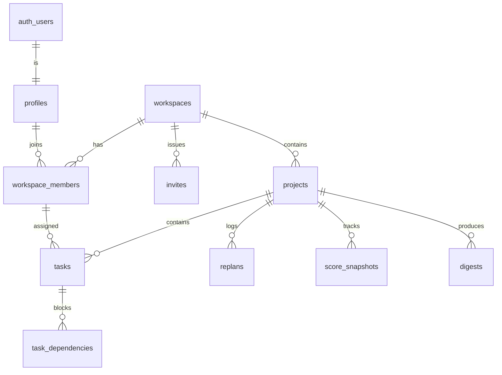

# Supabase Backend Design — PlanPulse

**Multi-user workspaces · daily score snapshots · two-phase RLS**

Sep 25, 2026 · @Zaheer Abbas

## Design summary

Ten tables, four enums, six functions, two RLS phases. Everything the app needs and nothing it doesn't.

### The decisions

| Decision | Choice | Why |
| --- | --- | --- |
| Tenancy | Workspace → membership → project → task | Every row traces to a workspace, so one RLS predicate covers the whole schema |
| Identity | `auth.users` → `profiles` (1:1) | Supabase owns credentials; `profiles` holds app data. Never join to `auth.users` in app queries |
| Capacity | On `workspace_members`, not `profiles` | The same person can be full-time on one workspace and 20% on another |
| Risk scores | Stored on the row, written by trigger | A number computed on render wobbles between refreshes and kills the demo |
| Snapshots | One row per project per day, upserted | A trend line without a cron job or 40 rows from one demo session |
| Dependencies | Edge list with a cycle guard trigger | A graph library is a day of work; an edge list plus a recursive CTE is an hour |
| Deletes | Soft on projects and tasks, hard elsewhere | Undo on the two things a user will delete by accident mid-demo |
| Invites | Token row, no email sending | Adding a teammate is a link you paste, not an SMTP integration |

### The invariants the database enforces

These are constraints and triggers, not conventions the front end is trusted to honour. Six people writing code in parallel will violate anything that is merely agreed.

1. A task's `assignee_id` must be a member of the same workspace as the task's project. Enforced by composite foreign key, not by application code.
2. A dependency cannot create a cycle, and cannot join tasks in different projects.
3. `risk_score` and `health_score` are never written by the client — the client has no grant on those columns.
4. Every table has `workspace_id` reachable in one hop, so no RLS policy needs a three-table join.
5. One membership row per person per workspace. One snapshot row per project per day.
6. `updated_at` is set by trigger, never by the client.

### Two-phase RLS, and why

Row-level security is the single most common reason a hackathon app works locally at hour 20 and returns empty arrays on stage at hour 39. Full workspace policies need a helper function, a membership lookup and careful handling of the recursion trap where the membership table's own policy queries the membership table.

So the rollout is split:

- **Phase 1, hour 6** — owner-only policies. `workspace.owner_id = auth.uid()`. Six one-line policies, impossible to get wrong. The team is unblocked and every screen works.
- **Phase 2, hour 14** — membership policies replace them in a single migration. Tested with a second account the same hour.

If Phase 2 goes badly, Phase 1 is still in the repo and the app still demos — as a single-user tool with named teammates. That fallback is the reason for the split.

### What this costs

Multi-user workspaces plus daily snapshots is roughly **7 hours** of the 40: 3 on the membership and invite tables, 3 on Phase 2 RLS and its tests, 1 on snapshots. Budget them in hours 4–14 and 14–26, and hold the hour-26 gate: if the health score is not rendering from real data, Phase 2 waits and the demo runs on Phase 1.

## The model

Everything hangs off `workspaces`. That is the design's one big idea: every row is one or two hops from a workspace, so every RLS policy is the same shape.



Reading it: a person signs up and gets a `profile`. A profile joins one or more `workspaces` through `workspace_members`, which is also where their weekly capacity lives. A workspace holds `projects`; a project holds `tasks`, its `replans`, its daily `score_snapshots` and its `digests`. Tasks are assigned to a membership, not to a profile — that is what guarantees an assignee actually belongs to the workspace. `task_dependencies` is the edge list that makes the risk engine possible.

### The tables at a glance

| Table | Rows in a live demo | Written by | Read by |
| --- | --- | --- | --- |
| `profiles` | 6 | Trigger on signup | Everything |
| `workspaces` | 1–2 | Client | Every policy |
| `workspace_members` | 5–6 | Client, invite accept | Risk engine, board |
| `invites` | 1–2 | Client | Invite accept flow |
| `projects` | 1–3 | Client | Dashboard, board |
| `tasks` | 14–30 | Client, `intake-tasks` | Board, risk engine |
| `task_dependencies` | 6–10 | Client, `intake-tasks` | Risk engine, replan |
| `replans` | 1–3 | `replan` function | Diff view |
| `score_snapshots` | 1 per project per day | Trigger | Trend chart |
| `digests` | 1–2 | `daily-digest` | Digest panel |

### The hop from any row to its workspace

This table is the RLS design in miniature. Nothing is more than two hops away, and nothing needs a join through three tables.

| Table | Path to workspace |
| --- | --- |
| `workspaces` | itself |
| `workspace_members`, `invites`, `projects` | `workspace_id` column |
| `tasks`, `replans`, `score_snapshots`, `digests` | `workspace_id` denormalised, kept true by trigger |
| `task_dependencies` | `workspace_id` denormalised |

The denormalised `workspace_id` on child tables is deliberate. Without it, the policy on `tasks` has to join `projects`, and the policy on `task_dependencies` has to join `tasks` then `projects` — which is both slower and much easier to get subtly wrong at 3am. A trigger copies the parent's `workspace_id` on insert, so the column can never drift.

## Conventions and types

Agree these in hour 1 and write them on the wall. Six people inventing their own column names is a merge conflict that takes three hours to unpick.

| Rule | Convention |
| --- | --- |
| Table names | `snake_case`, plural (`tasks`, `workspace_members`) |
| Primary keys | `id uuid primary key default gen_random_uuid()` |
| Foreign keys | `<singular_table>_id` (`project_id`, `assignee_member_id`) |
| Timestamps | `timestamptz`, never `timestamp`. `created_at`, `updated_at`, `deleted_at` |
| Dates | `date` for due dates and target dates — a deadline has no timezone |
| Booleans | `is_` prefix, `not null default false` |
| Money / hours | `numeric(6,2)` for hours. Never `float` |
| Scores | `smallint`, 0–100, with a check constraint |
| JSON | `jsonb`, never `json` |
| Schema | Everything in `public`. No custom schemas — Supabase's client only exposes `public` by default |

### Enums

Four enum types. Postgres enums are fast and self-documenting, and the trade-off that usually argues against them — you cannot drop a value — does not matter in a 40-hour project.

```sql
create type task_status as enum ('todo', 'in_progress', 'blocked', 'done');
create type task_priority as enum ('low', 'medium', 'high', 'critical');
create type member_role as enum ('owner', 'admin', 'member');
create type invite_status as enum ('pending', 'accepted', 'revoked', 'expired');
```

`task_status` is deliberately fixed at four values. User-defined columns are a tempting feature and would cost a `board_columns` table, an ordering column, a migration path for existing tasks, and a UI for managing them — half a day for something no judge will ask about.

### Extensions

```sql
create extension if not exists pgcrypto;   -- gen_random_uuid()
create extension if not exists pg_trgm;    -- optional: task title search
```

Supabase enables `pgcrypto` by default on new projects, but declare it anyway so the migration runs on a fresh database.

### The two rules that cause the most pain when broken

**Never expose `auth.users`.** Query `profiles` instead. Joining to `auth.users` from the client fails under RLS in ways whose error messages do not say so.

**Every child table carries `workspace_id`.** It is redundant, and that redundancy is the point — it makes every policy a single-table predicate. A trigger keeps it correct, so no one can insert a row into the wrong workspace by hand.

## Tables

Ten tables. Each one below gives the DDL, then the columns that need explaining.

### `profiles`

One row per authenticated user, created by trigger on signup so the app never has to remember to create it.

```sql
create table profiles (
  id          uuid primary key references auth.users(id) on delete cascade,
  full_name   text not null default '',
  avatar_url  text,
  created_at  timestamptz not null default now(),
  updated_at  timestamptz not null default now()
);
```

`id` is the `auth.users` id rather than a fresh uuid — one less join everywhere, and `auth.uid()` can be compared to it directly in policies.

### `workspaces`

```sql
create table workspaces (
  id          uuid primary key default gen_random_uuid(),
  name        text not null check (length(trim(name)) between 1 and 80),
  owner_id    uuid not null references profiles(id) on delete restrict,
  created_at  timestamptz not null default now(),
  updated_at  timestamptz not null default now()
);
```

`owner_id` is `on delete restrict`, not cascade. Deleting a user should not silently delete a workspace other people are working in — transfer ownership first.

### `workspace_members`

The join table, and the home of capacity. This is the table the risk engine reads most.

```sql
create table workspace_members (
  id                 uuid primary key default gen_random_uuid(),
  workspace_id       uuid not null references workspaces(id) on delete cascade,
  profile_id         uuid references profiles(id) on delete set null,
  display_name       text not null,
  role               member_role not null default 'member',
  capacity_hours     numeric(5,2) not null default 30
                       check (capacity_hours >= 0 and capacity_hours <= 80),
  created_at         timestamptz not null default now(),
  updated_at         timestamptz not null default now(),
  unique (workspace_id, profile_id)
);
```

Three things to notice.

**`profile_id` is nullable.** That is what lets a lead add "Priya, 30 hours a week" to the board before Priya has signed up. When she accepts her invite, the row is claimed by setting `profile_id`. Without this, seeding a realistic demo board would require five real signups.

**`display_name` is on the membership, not the profile.** It is set when the placeholder member is created and stays stable after the invite is accepted.

**`capacity_hours` lives here** because the same person can be full-time on one workspace and part-time on another. It is the denominator of the load factor in the risk formula.

### `invites`

```sql
create table invites (
  id            uuid primary key default gen_random_uuid(),
  workspace_id  uuid not null references workspaces(id) on delete cascade,
  member_id     uuid references workspace_members(id) on delete set null,
  email         citext,
  token         text not null unique default encode(gen_random_bytes(18), 'hex'),
  status        invite_status not null default 'pending',
  expires_at    timestamptz not null default now() + interval '7 days',
  created_by    uuid not null references profiles(id) on delete cascade,
  created_at    timestamptz not null default now()
);
```

No email is sent. The lead copies the link. `member_id` lets an invite claim a specific placeholder member, so accepting it attaches the new user to "Priya" rather than creating a duplicate.

### `projects`

```sql
create table projects (
  id            uuid primary key default gen_random_uuid(),
  workspace_id  uuid not null references workspaces(id) on delete cascade,
  name          text not null check (length(trim(name)) between 1 and 120),
  description   text,
  start_date    date not null default current_date,
  target_date   date not null,
  health_score  smallint not null default 100 check (health_score between 0 and 100),
  created_by    uuid not null references profiles(id) on delete set null,
  created_at    timestamptz not null default now(),
  updated_at    timestamptz not null default now(),
  deleted_at    timestamptz,
  check (target_date >= start_date)
);
```

`health_score` is stored, written only by trigger. The client has no update grant on it.

### `tasks`

The core table.

```sql
create table tasks (
  id                  uuid primary key default gen_random_uuid(),
  workspace_id        uuid not null references workspaces(id) on delete cascade,
  project_id          uuid not null references projects(id) on delete cascade,
  title               text not null check (length(trim(title)) between 1 and 200),
  description         text,
  status              task_status not null default 'todo',
  priority            task_priority not null default 'medium',
  assignee_member_id  uuid references workspace_members(id) on delete set null,
  estimate_hours      numeric(5,2) not null default 4
                        check (estimate_hours > 0 and estimate_hours <= 200),
  due_date            date,
  status_changed_at   timestamptz not null default now(),
  started_at          timestamptz,
  completed_at        timestamptz,
  order_index         numeric not null default 1000,
  risk_score          smallint not null default 0 check (risk_score between 0 and 100),
  risk_reason         text,
  risk_factors        jsonb not null default '{}'::jsonb,
  source              text not null default 'manual'
                        check (source in ('manual','ai_intake','replan')),
  created_at          timestamptz not null default now(),
  updated_at          timestamptz not null default now(),
  deleted_at          timestamptz,
  unique (id, workspace_id)
);
```

| Column | Why it exists |
| --- | --- |
| `status_changed_at` | The staleness factor. "In progress for nine days" is only computable if you record when the status last moved |
| `order_index` as `numeric` | Drag-and-drop between two cards sets the midpoint of its neighbours. No renumbering the whole column on every drop |
| `risk_factors` jsonb | Stores the four factor values behind the score, so the risk panel can show the breakdown without recomputing |
| `source` | Lets the demo say "these 9 tasks came from the pasted notes", and lets you filter out AI-created rows if intake goes wrong |
| `unique (id, workspace_id)` | Not redundant — it is the target of the composite foreign key that guarantees dependencies stay in one workspace |

The assignee integrity rule needs a composite key on `workspace_members` too:

```sql
alter table workspace_members add constraint workspace_members_id_ws_key
  unique (id, workspace_id);

alter table tasks add constraint tasks_assignee_same_workspace
  foreign key (assignee_member_id, workspace_id)
  references workspace_members(id, workspace_id) on delete set null;
```

That is the whole enforcement of "you cannot assign a task to someone outside the workspace". No trigger, no application check, no possible bug.

### `task_dependencies`

```sql
create table task_dependencies (
  id              uuid primary key default gen_random_uuid(),
  workspace_id    uuid not null references workspaces(id) on delete cascade,
  blocker_task_id uuid not null,
  blocked_task_id uuid not null,
  created_at      timestamptz not null default now(),
  unique (blocker_task_id, blocked_task_id),
  check (blocker_task_id <> blocked_task_id),
  foreign key (blocker_task_id, workspace_id)
    references tasks(id, workspace_id) on delete cascade,
  foreign key (blocked_task_id, workspace_id)
    references tasks(id, workspace_id) on delete cascade
);
```

Read it as "blocker must finish before blocked can start". The composite foreign keys mean a dependency cannot span two workspaces. Cycles are caught by a trigger, covered in the functions section.

### `replans`

```sql
create table replans (
  id            uuid primary key default gen_random_uuid(),
  workspace_id  uuid not null references workspaces(id) on delete cascade,
  project_id    uuid not null references projects(id) on delete cascade,
  before_score  smallint not null check (before_score between 0 and 100),
  after_score   smallint not null check (after_score between 0 and 100),
  changes       jsonb not null,
  rationale     text,
  applied_at    timestamptz,
  reverted_at   timestamptz,
  created_by    uuid not null references profiles(id) on delete set null,
  created_at    timestamptz not null default now()
);
```

`changes` holds an array of `{ task_id, field, from, to, reason }`. Storing the diff rather than mutating silently is what makes the undo button possible, and undo is worth having on stage — it lets you run the replan twice in one demo.

### `score_snapshots`

```sql
create table score_snapshots (
  id             uuid primary key default gen_random_uuid(),
  workspace_id   uuid not null references workspaces(id) on delete cascade,
  project_id     uuid not null references projects(id) on delete cascade,
  snapshot_date  date not null default current_date,
  health_score   smallint not null check (health_score between 0 and 100),
  task_count     smallint not null default 0,
  blocked_count  smallint not null default 0,
  overloaded_members smallint not null default 0,
  created_at     timestamptz not null default now(),
  unique (project_id, snapshot_date)
);
```

The unique constraint on `(project_id, snapshot_date)` is what makes this an upsert rather than an append. Forty recomputes during a demo produce one row, with the latest score. The extra counters are there so the trend chart can show more than one line without a second query.

### `digests`

```sql
create table digests (
  id            uuid primary key default gen_random_uuid(),
  workspace_id  uuid not null references workspaces(id) on delete cascade,
  project_id    uuid not null references projects(id) on delete cascade,
  body          text not null,
  task_ids      uuid[] not null default '{}',
  created_at    timestamptz not null default now()
);
```

Plain text, because its only job is to be copied into Slack.

## Indexes

At demo scale — 30 tasks — none of these change a query plan. They are here because two of them are not optional under RLS, and because adding them costs sixty seconds now versus a confusing slowdown later if you seed a larger dataset for the pitch.

```sql
-- RLS predicates hit these on every single query
create index idx_members_profile on workspace_members(profile_id);
create index idx_members_workspace on workspace_members(workspace_id);

-- Board and dashboard reads
create index idx_projects_workspace on projects(workspace_id) where deleted_at is null;
create index idx_tasks_project_status on tasks(project_id, status) where deleted_at is null;
create index idx_tasks_assignee on tasks(assignee_member_id) where deleted_at is null;
create index idx_tasks_order on tasks(project_id, status, order_index) where deleted_at is null;

-- Risk engine and replan
create index idx_deps_blocker on task_dependencies(blocker_task_id);
create index idx_deps_blocked on task_dependencies(blocked_task_id);
create index idx_tasks_risk on tasks(project_id, risk_score desc) where deleted_at is null;

-- Trend chart and history
create index idx_snapshots_project_date on score_snapshots(project_id, snapshot_date desc);
create index idx_replans_project on replans(project_id, created_at desc);

-- Invite accept
create index idx_invites_token on invites(token) where status = 'pending';
```

| Index | Serves | Notes |
| --- | --- | --- |
| `idx_members_profile` | Every RLS policy in the schema | **Not optional.** The membership lookup runs on every row read |
| `idx_members_workspace` | Member list, load bars, replan | Also serves the RLS helper function |
| `idx_tasks_project_status` | Board column queries | Partial on `deleted_at is null` — soft-deleted rows never appear in a board query |
| `idx_tasks_order` | Rendering a column in order | Covers the drag-and-drop read path |
| `idx_deps_blocker` / `idx_deps_blocked` | The recursive CTE in the cycle guard and the blocked-depth factor | Both directions are traversed, so both are needed |
| `idx_tasks_risk` | Ranked risk list, worst first | The Risk Radar's main query |
| `idx_snapshots_project_date` | Trend chart | Descending, because you always want the recent end |
| `idx_invites_token` | Invite accept lookup | Partial — only pending invites are ever looked up by token |

### What is deliberately not indexed

No full-text or trigram index on `tasks.title`. Search is not in scope, and if someone adds a search box at hour 30 they can add `create index ... using gin (title gin_trgm_ops)` in one line. No index on `created_at` anywhere — nothing sorts by it at this scale.

## Row-level security

### The recursion trap, first

The obvious policy on `workspace_members` is "you can see members of workspaces you're a member of". Written directly, that policy queries `workspace_members` from inside the policy *on* `workspace_members`, and Postgres either errors with infinite recursion or silently returns nothing. This is the bug that eats an afternoon.

The fix is a `security definer` function, which bypasses RLS on its own lookup:

```sql
create or replace function public.is_workspace_member(ws uuid)
returns boolean
language sql
stable
security definer
set search_path = public
as $$
  select exists (
    select 1 from workspace_members m
    where m.workspace_id = ws and m.profile_id = auth.uid()
  );
$$;

create or replace function public.workspace_role(ws uuid)
returns member_role
language sql
stable
security definer
set search_path = public
as $$
  select m.role from workspace_members m
  where m.workspace_id = ws and m.profile_id = auth.uid()
  limit 1;
$$;

revoke execute on function public.is_workspace_member(uuid) from public;
grant execute on function public.is_workspace_member(uuid) to authenticated;
```

`set search_path = public` on a `security definer` function is a security requirement, not a style choice — without it the function can be hijacked by a malicious `search_path`.

### Phase 1 — owner-only, ship at hour 6

Six policies, no helper functions, no recursion risk. The app works end to end from hour 6 and nobody is blocked.

```sql
alter table workspaces enable row level security;
create policy p1_workspaces on workspaces for all
  using (owner_id = auth.uid()) with check (owner_id = auth.uid());

-- and for each child table, the same shape:
alter table projects enable row level security;
create policy p1_projects on projects for all
  using (exists (select 1 from workspaces w
                 where w.id = projects.workspace_id and w.owner_id = auth.uid()));
```

Repeat for `workspace_members`, `tasks`, `task_dependencies`, `replans`, `score_snapshots`, `digests`, `invites`. Drop them all in Phase 2.

### Phase 2 — membership policies, hour 14

```sql
-- profiles: you see yourself, and anyone who shares a workspace with you
create policy profiles_select on profiles for select
  using (
    id = auth.uid()
    or exists (
      select 1 from workspace_members me
      join workspace_members them on them.workspace_id = me.workspace_id
      where me.profile_id = auth.uid() and them.profile_id = profiles.id
    )
  );
create policy profiles_update on profiles for update
  using (id = auth.uid()) with check (id = auth.uid());

-- workspaces
create policy ws_select on workspaces for select
  using (public.is_workspace_member(id));
create policy ws_insert on workspaces for insert
  with check (owner_id = auth.uid());
create policy ws_update on workspaces for update
  using (public.workspace_role(id) in ('owner','admin'));
create policy ws_delete on workspaces for delete
  using (owner_id = auth.uid());

-- workspace_members (no recursion: the helper is security definer)
create policy members_select on workspace_members for select
  using (public.is_workspace_member(workspace_id));
create policy members_write on workspace_members for all
  using (public.workspace_role(workspace_id) in ('owner','admin'))
  with check (public.workspace_role(workspace_id) in ('owner','admin'));
```

Every remaining table gets the identical pair, because they all carry `workspace_id`:

```sql
create policy tasks_rw on tasks for all
  using (public.is_workspace_member(workspace_id))
  with check (public.is_workspace_member(workspace_id));
```

Apply that same two-line policy to `projects`, `task_dependencies`, `replans`, `score_snapshots` and `digests`. That uniformity is the entire payoff of denormalising `workspace_id`.

### Column grants — the scores the client cannot write

RLS controls rows. Protecting the score columns needs column grants.

```sql
revoke update on tasks from authenticated;
grant update (title, description, status, priority, assignee_member_id,
              estimate_hours, due_date, order_index, deleted_at)
  on tasks to authenticated;

revoke update on projects from authenticated;
grant update (name, description, start_date, target_date, deleted_at)
  on projects to authenticated;
```

Now `risk_score`, `risk_factors` and `health_score` can only be written by the trigger, which runs as the table owner. A front-end bug cannot corrupt the number the whole demo rests on.

### Invites

The one place the rules differ, because an invitee is by definition not yet a member.

```sql
create policy invites_manage on invites for all
  using (public.workspace_role(workspace_id) in ('owner','admin'))
  with check (public.workspace_role(workspace_id) in ('owner','admin'));
```

Accepting an invite happens in a `security definer` RPC, not through a policy — the caller has no rights on that workspace yet:

```sql
create or replace function public.accept_invite(p_token text)
returns uuid
language plpgsql
security definer
set search_path = public
as $$
declare v_invite invites; v_ws uuid;
begin
  select * into v_invite from invites
   where token = p_token and status = 'pending' and expires_at > now();
  if not found then raise exception 'invalid or expired invite'; end if;

  if v_invite.member_id is not null then
    update workspace_members set profile_id = auth.uid()
     where id = v_invite.member_id and profile_id is null;
  else
    insert into workspace_members (workspace_id, profile_id, display_name)
    values (v_invite.workspace_id, auth.uid(),
            coalesce((select full_name from profiles where id = auth.uid()), 'Member'))
    on conflict (workspace_id, profile_id) do nothing;
  end if;

  update invites set status = 'accepted' where id = v_invite.id;
  v_ws := v_invite.workspace_id;
  return v_ws;
end;
$$;
```

### Edge Functions and the service role

`intake-tasks`, `replan` and `daily-digest` run server-side with the **service role key**, which bypasses RLS entirely. Two rules:

1. The service role key never leaves Supabase secrets. It is never in front-end code, never in the repo, never in a `VITE_` variable.
2. Every Edge Function must verify the caller's JWT and check that caller is a member of the workspace it is about to write to. Bypassing RLS means you are now responsible for the check that RLS was doing.

```ts
const { data: { user } } = await userClient.auth.getUser();
if (!user) return new Response('unauthorized', { status: 401 });

const { data: member } = await admin
  .from('workspace_members')
  .select('id')
  .eq('workspace_id', workspaceId)
  .eq('profile_id', user.id)
  .maybeSingle();
if (!member) return new Response('forbidden', { status: 403 });
```

Those nine lines go at the top of all four functions. Skipping them turns every Edge Function into an open door to every workspace in the database.

## Functions and triggers

Six pieces of server-side logic. Together they are what makes the risk score trustworthy enough to put on a stage.

| Function | Fires | Job |
| --- | --- | --- |
| `set_updated_at` | Before update, every table | Stamp `updated_at` |
| `handle_new_user` | After insert on `auth.users` | Create the profile |
| `inherit_workspace_id` | Before insert on child tables | Copy the parent's `workspace_id` |
| `track_status_change` | Before update on `tasks` | Maintain `status_changed_at`, `started_at`, `completed_at` |
| `guard_dependency_cycle` | Before insert on `task_dependencies` | Reject cycles |
| `recompute_project_risk` | After write on `tasks` and `task_dependencies` | Score every task, score the project, upsert today's snapshot |

### Housekeeping triggers

```sql
create or replace function set_updated_at() returns trigger
language plpgsql as $$
begin new.updated_at := now(); return new; end; $$;

create trigger t_profiles_updated before update on profiles
  for each row execute function set_updated_at();
-- repeat for workspaces, workspace_members, projects, tasks

create or replace function handle_new_user() returns trigger
language plpgsql security definer set search_path = public as $$
begin
  insert into profiles (id, full_name)
  values (new.id, coalesce(new.raw_user_meta_data->>'full_name', ''));
  return new;
end; $$;

create trigger t_auth_user_created after insert on auth.users
  for each row execute function handle_new_user();
```

### Inheriting `workspace_id`

This is what makes the denormalised column safe — the client never sets it.

```sql
create or replace function inherit_workspace_id() returns trigger
language plpgsql as $$
begin
  if new.workspace_id is null then
    select p.workspace_id into new.workspace_id
      from projects p where p.id = new.project_id;
  end if;
  return new;
end; $$;

create trigger t_tasks_ws before insert on tasks
  for each row execute function inherit_workspace_id();
-- repeat for replans, score_snapshots, digests
```

### Status transitions

The staleness factor depends entirely on this trigger being correct.

```sql
create or replace function track_status_change() returns trigger
language plpgsql as $$
begin
  if new.status is distinct from old.status then
    new.status_changed_at := now();
    if new.status = 'in_progress' and old.started_at is null then
      new.started_at := now();
    end if;
    if new.status = 'done' then new.completed_at := now();
    else new.completed_at := null; end if;
  end if;
  return new;
end; $$;

create trigger t_tasks_status before update on tasks
  for each row execute function track_status_change();
```

### The cycle guard

A dependency cycle makes the topological sort in `replan` hang or throw. Catch it at write time, where the error can be shown to the user as "that would create a loop".

```sql
create or replace function guard_dependency_cycle() returns trigger
language plpgsql as $$
begin
  if exists (
    with recursive reachable as (
      select new.blocked_task_id as task_id
      union
      select d.blocked_task_id
        from task_dependencies d
        join reachable r on d.blocker_task_id = r.task_id
    )
    select 1 from reachable where task_id = new.blocker_task_id
  ) then
    raise exception 'dependency would create a cycle'
      using errcode = 'check_violation';
  end if;
  return new;
end; $$;

create trigger t_deps_cycle before insert on task_dependencies
  for each row execute function guard_dependency_cycle();
```

### The risk recompute

The most important function in the schema. It implements the formula from the build plan:

```latex
R = 30 \cdot S + 25 \cdot B + 25 \cdot L + 20 \cdot D
```

```sql
create or replace function recompute_project_risk(p_project uuid)
returns void language plpgsql security definer set search_path = public as $$
declare v_total numeric; v_health smallint;
begin
  with live as (
    select * from tasks where project_id = p_project and deleted_at is null
  ),
  n as (select greatest(count(*), 1)::numeric total from live),
  load as (
    select t.assignee_member_id mid,
           sum(t.estimate_hours) filter (where t.status <> 'done') hrs,
           max(m.capacity_hours) cap
      from live t join workspace_members m on m.id = t.assignee_member_id
     group by t.assignee_member_id
  ),
  downstream as (
    select r.root, count(*)::numeric depth from (
      with recursive walk as (
        select d.blocker_task_id root, d.blocked_task_id child
          from task_dependencies d
        union
        select w.root, d.blocked_task_id
          from task_dependencies d join walk w on d.blocker_task_id = w.child
      ) select * from walk
    ) r group by r.root
  ),
  scored as (
    select t.id,
      least(1.0, extract(epoch from (now() - t.status_changed_at))
                 / nullif(86400 * greatest(t.estimate_hours / 6.0, 0.5), 0)) s,
      least(1.0, coalesce(dn.depth, 0) / (select total from n))            b,
      least(1.0, greatest(0, coalesce(l.hrs, 0) / nullif(l.cap, 0) - 1))   l,
      least(1.0, greatest(0, 1 - (t.due_date - current_date)::numeric
                 / nullif(greatest(t.estimate_hours / 6.0, 0.5), 0)))      d
      from live t
      left join downstream dn on dn.root = t.id
      left join load l on l.mid = t.assignee_member_id
     where t.status <> 'done'
  )
  update tasks t set
    risk_score = round(30*sc.s + 25*sc.b + 25*sc.l + 20*sc.d),
    risk_factors = jsonb_build_object('staleness', round(sc.s,3),
                      'blocked_depth', round(sc.b,3),
                      'owner_load', round(sc.l,3),
                      'deadline', round(sc.d,3))
  from scored sc where t.id = sc.id;

  update tasks set risk_score = 0, risk_factors = '{}'::jsonb
   where project_id = p_project and status = 'done';

  select coalesce(
    100 - (sum(risk_score * estimate_hours) / nullif(sum(estimate_hours),0)), 100)
    into v_health
    from tasks where project_id = p_project and deleted_at is null;

  update projects set health_score = greatest(0, least(100, v_health))
   where id = p_project;

  insert into score_snapshots
    (workspace_id, project_id, snapshot_date, health_score,
     task_count, blocked_count, overloaded_members)
  select p.workspace_id, p.id, current_date, p.health_score,
         (select count(*) from tasks where project_id = p.id and deleted_at is null),
         (select count(*) from tasks where project_id = p.id and status = 'blocked'),
         (select count(*) from load_view where project_id = p.id and over_capacity)
    from projects p where p.id = p_project
  on conflict (project_id, snapshot_date) do update
    set health_score = excluded.health_score,
        task_count = excluded.task_count,
        blocked_count = excluded.blocked_count,
        overloaded_members = excluded.overloaded_members;
end; $$;
```

The trigger that calls it, debounced to `statement` level so a bulk insert of 14 tasks recomputes once, not fourteen times:

```sql
create or replace function trg_recompute_risk() returns trigger
language plpgsql as $$
begin
  perform recompute_project_risk(p) from (
    select distinct project_id p from new_rows
  ) x;
  return null;
end; $$;

create trigger t_tasks_risk after insert or update or delete on tasks
  referencing new table as new_rows
  for each statement execute function trg_recompute_risk();
```

The `on conflict (project_id, snapshot_date) do update` is what keeps a demo session to one snapshot row per project per day while still letting the trend chart show real history over the hackathon.

### The load view

Used by the recompute above and by the load bars in the UI, so it is defined once:

```sql
create view load_view as
select m.workspace_id, t.project_id, m.id member_id, m.display_name,
       m.capacity_hours,
       coalesce(sum(t.estimate_hours) filter (where t.status <> 'done'), 0) assigned_hours,
       coalesce(sum(t.estimate_hours) filter (where t.status <> 'done'), 0)
         > m.capacity_hours as over_capacity
  from workspace_members m
  left join tasks t on t.assignee_member_id = m.id and t.deleted_at is null
 group by m.workspace_id, t.project_id, m.id, m.display_name, m.capacity_hours;
```

Create it with `security_invoker = true` so it respects the caller's RLS rather than the view owner's:

```sql
alter view load_view set (security_invoker = true);
```

## Migrations and Edge Function contracts

### Apply order

Eight files, run in order. Keep them numbered in `supabase/migrations/` so a teammate can rebuild the database from scratch in one command when something goes wrong at hour 28.

| # | File | Contents | Hour |
| --- | --- | --- | --- |
| 001 | `extensions_and_types.sql` | `pgcrypto`, `citext`, the four enums | 4 |
| 002 | `core_tables.sql` | profiles, workspaces, workspace\_members, invites | 5 |
| 003 | `work_tables.sql` | projects, tasks, task\_dependencies | 5 |
| 004 | `analytics_tables.sql` | replans, score\_snapshots, digests | 6 |
| 005 | `indexes.sql` | Every index | 6 |
| 006 | `rls_phase1.sql` | Owner-only policies | 6 |
| 007 | `functions_triggers.sql` | All six functions, the view, the triggers | 10 |
| 008 | `rls_phase2.sql` | Drop Phase 1, create membership policies, column grants | 14 |

Rebuild command, worth pinning in your team chat:

```bash
supabase db reset          # drops, recreates, replays all migrations, runs seed.sql
```

### Edge Function contracts

Freeze these shapes in hour 1. The front end builds against mocks that match them; the AI engineer makes reality match. Neither waits for the other.

**`intake-tasks`**

```json
// request
{ "workspace_id": "uuid", "project_id": "uuid", "raw_text": "string" }

// response
{ "tasks": [
    { "title": "string", "description": "string",
      "estimate_hours": 6, "priority": "high",
      "suggested_assignee": "Priya", "depends_on": ["Set up CI"] } ],
  "warnings": ["string"] }
```

The function returns a **draft**. It does not write to `tasks`. The user reviews and edits on the Intake screen, then the client inserts. That review step is worth building: it is what stops a bad LLM response from silently corrupting the board mid-demo, and it looks deliberate rather than defensive.

**`explain-risk`**

```json
// request
{ "task_id": "uuid" }
// response
{ "reason": "Blocked 9 days behind API auth, and 3 tasks wait on it." }
```

Writes `tasks.risk_reason` with the service role. One sentence, never more — cap it in the prompt and truncate server-side.

**`replan`**

```json
// request
{ "project_id": "uuid", "strategy": "balance_load" }

// response
{ "replan_id": "uuid", "before_score": 34, "after_score": 82,
  "changes": [ { "task_id": "uuid", "field": "due_date",
                 "from": "2026-10-02", "to": "2026-10-07",
                 "reason": "Waits on API auth, which slipped 3 days" } ] }
```

The order inside this function matters, and it is the heart of the whole product:

1. Read the project's tasks, dependencies and member capacities.
2. **Compute** the new schedule in TypeScript — topological sort, then greedy assignment to the least-loaded member with capacity.
3. Call the LLM **only** to write the `reason` string for each change.
4. Write the `replans` row with `before_score`, `after_score` and the diff.
5. Apply the changes inside one transaction via an RPC, so the trigger recomputes once.

Code proposes, model narrates. Reversing those two steps is how the demo number becomes unreliable.

**`daily-digest`**

```json
// request
{ "project_id": "uuid" }
// response
{ "digest_id": "uuid", "body": "markdown string" }
```

### The apply-replan RPC

Applying a replan through a dozen separate client updates fires the recompute trigger a dozen times and shows a flickering score on stage. One RPC, one transaction, one recompute:

```sql
create or replace function public.apply_replan(p_replan uuid)
returns void language plpgsql security definer set search_path = public as $$
declare c jsonb; v_project uuid;
begin
  select project_id into v_project from replans where id = p_replan;
  if not public.is_workspace_member(
       (select workspace_id from replans where id = p_replan))
  then raise exception 'forbidden'; end if;

  for c in select jsonb_array_elements(changes) from replans where id = p_replan
  loop
    if c->>'field' = 'due_date' then
      update tasks set due_date = (c->>'to')::date where id = (c->>'task_id')::uuid;
    elsif c->>'field' = 'assignee_member_id' then
      update tasks set assignee_member_id = (c->>'to')::uuid
       where id = (c->>'task_id')::uuid;
    end if;
  end loop;

  update replans set applied_at = now() where id = p_replan;
  perform recompute_project_risk(v_project);
end; $$;
```

The matching `revert_replan` reads the same diff and writes `from` instead of `to` — twenty lines, and it lets you run the replan demo twice in a row without reseeding.

## Seed data

The fixture is engineered so the health score lands near 34 and the replan can plausibly lift it past 80. Build it in hour 4, not hour 38 — the numbers need tuning and you will not have the patience later.

### The shape of the fixture

| Element | Value | Why |
| --- | --- | --- |
| Project | "Mobile App v2 Launch", target 14 days out | Short enough that deadline pressure is real |
| Members | 5, capacities 30 / 30 / 20 / 30 / 15 | Two part-timers make the load imbalance believable |
| Tasks | 14 — 3 done, 4 in progress, 2 blocked, 5 todo | A board that looks alive, not empty |
| Overloaded | Priya: 42 assigned hours against 30 capacity | The "140% load" line in the demo |
| Blocked chains | API auth → 3 downstream; payments → 2 downstream | Gives the blocked-depth factor something to find |
| Stale task | One `in_progress` with `status_changed_at` 9 days ago | The "in progress for three weeks" story |

### `seed.sql`

```sql
-- Runs after migrations on `supabase db reset`.
-- Create the demo auth user in the dashboard first, then paste its id here.
\set demo_user '00000000-0000-0000-0000-000000000001'

insert into profiles (id, full_name) values (:'demo_user', 'Zaheer Abbas')
  on conflict (id) do nothing;

insert into workspaces (id, name, owner_id)
values ('11111111-1111-1111-1111-111111111111', 'Acme Delivery', :'demo_user');

insert into workspace_members
  (id, workspace_id, profile_id, display_name, role, capacity_hours) values
  ('a1', '1111...', :'demo_user', 'Zaheer', 'owner',  30),
  ('a2', '1111...', null,         'Priya',  'member', 30),
  ('a3', '1111...', null,         'Rahul',  'member', 20),
  ('a4', '1111...', null,         'Sneha',  'member', 30),
  ('a5', '1111...', null,         'Arjun',  'member', 15);

insert into projects (id, workspace_id, name, start_date, target_date, created_by)
values ('p1', '1111...', 'Mobile App v2 Launch',
        current_date - 12, current_date + 14, :'demo_user');
```

The task inserts, with the timing that produces the score:

```sql
insert into tasks (id, project_id, title, status, priority,
                   assignee_member_id, estimate_hours, due_date,
                   status_changed_at, order_index) values
 -- done: gives the board a credible history
 ('t01','p1','Design system audit','done','medium','a4', 8, current_date-6, now()-interval '6 days', 1000),
 ('t02','p1','Set up CI pipeline','done','high','a1', 6, current_date-4, now()-interval '4 days', 2000),
 ('t03','p1','Wireframe onboarding','done','low','a4', 5, current_date-3, now()-interval '3 days', 3000),

 -- the stale one: the demo's opening line
 ('t04','p1','API authentication service','in_progress','critical','a2',
   16, current_date-2, now()-interval '9 days', 4000),

 ('t05','p1','Payment gateway integration','in_progress','critical','a2',
   14, current_date+1, now()-interval '5 days', 5000),
 ('t06','p1','Push notification service','in_progress','high','a3',
   10, current_date+3, now()-interval '2 days', 6000),
 ('t07','p1','Profile screen','in_progress','medium','a5', 8, current_date+5, now()-interval '1 day', 7000),

 -- blocked behind t04 and t05
 ('t08','p1','Session management','blocked','high','a2', 12, current_date+2, now()-interval '4 days', 8000),
 ('t09','p1','Checkout flow','blocked','critical','a3', 10, current_date+4, now()-interval '3 days', 9000),

 -- todo
 ('t10','p1','Biometric login','todo','medium','a2', 8, current_date+6, now()-interval '2 days', 10000),
 ('t11','p1','Order history screen','todo','medium','a3', 6, current_date+8, now()-interval '2 days', 11000),
 ('t12','p1','Refund handling','todo','high','a5', 7, current_date+9, now()-interval '1 day', 12000),
 ('t13','p1','Analytics events','todo','low','a4', 5, current_date+11, now()-interval '1 day', 13000),
 ('t14','p1','Release checklist and store submission','todo','critical','a1',
   6, current_date+13, now()-interval '1 day', 14000);

insert into task_dependencies (blocker_task_id, blocked_task_id) values
 ('t04','t08'), ('t04','t10'), ('t04','t14'),   -- API auth blocks 3
 ('t05','t09'), ('t05','t12'),                  -- payments blocks 2
 ('t08','t07'), ('t09','t11'), ('t06','t14');

select recompute_project_risk('p1');
```

Use real uuids in the actual file — the short ids above are for reading. Generate them once and keep them stable, so anyone on the team can reference "t04" in a bug report.

### Why these numbers work

**Priya (`a2`) carries t04, t05, t08 and t10** — 16 + 14 + 12 + 8 = 50 hours against a 30-hour capacity. That is 167% load, and it is what the replan fixes by moving t10 and t08 to Sneha and Arjun.

**t04 is the keystone.** It is stale by 9 days, critical, already past its due date, and three tasks wait behind it. It will score in the high 80s and sit at the top of the ranked risk list, which is exactly the card you want to click on camera.

**The health score lands in the low-to-mid 30s** with this fixture. After a replan that redistributes Priya's load and pushes the blocked chain's dates out by three days, it should land in the low 80s. Tune `capacity_hours` and the two `status_changed_at` offsets to hit the exact numbers you want on screen — that is a five-minute job once the recompute works.

### Reset between demo takes

```sql
create or replace function public.reset_demo() returns void
language plpgsql security definer set search_path = public as $$
begin
  delete from replans where project_id = 'p1';
  delete from score_snapshots where project_id = 'p1' and snapshot_date = current_date;
  -- re-apply the original assignees and dates
  update tasks set assignee_member_id = d.mid, due_date = d.dt
    from demo_baseline d where tasks.id = d.task_id;
  perform recompute_project_risk('p1');
end; $$;
```

Store the baseline in a small `demo_baseline` table populated by the seed. One call and the board is back to 34, ready for take three of the Loom. This is worth the twenty minutes it costs.

## Verification

Run these before hour 30. Every one of them catches a failure that otherwise appears for the first time in front of a judge.

### The RLS tests — the ones that matter most

Create a second auth user in the Supabase dashboard, put them in no workspace, and run each of these as that user with an anon-key client.

| # | Test | Expected | Catches |
| --- | --- | --- | --- |
| 1 | `select * from projects` as the outsider | 0 rows | The classic "works for me" bug |
| 2 | `select * from tasks` as the outsider | 0 rows | Missing policy on a child table |
| 3 | `insert into tasks (project_id...)` with someone else's project id | Error | Write policy missing `with check` |
| 4 | `select * from workspace_members` as a member | Only their workspace's rows | The recursion trap |
| 5 | `update tasks set risk_score = 0` as a member | Permission denied | Column grants not applied |
| 6 | Accept an invite, re-run test 1 | Their workspace's rows appear | Invite RPC and membership policy |

Test 4 is the one that reveals the recursion bug. If it hangs or returns nothing for a legitimate member, the `security definer` helper is missing or its `search_path` is unset.

### Integrity tests

```sql
-- assignee from another workspace must fail
insert into tasks (project_id, title, assignee_member_id)
values ('p1', 'x', '<member id from a different workspace>');
-- expected: foreign key violation on tasks_assignee_same_workspace

-- cycle must be rejected
insert into task_dependencies (blocker_task_id, blocked_task_id) values ('t08','t04');
-- expected: 'dependency would create a cycle'

-- self-dependency must be rejected
insert into task_dependencies (blocker_task_id, blocked_task_id) values ('t04','t04');
-- expected: check violation

-- duplicate membership must be rejected
insert into workspace_members (workspace_id, profile_id, display_name)
values ('1111...', '<existing profile>', 'Dup');
-- expected: unique violation
```

### Score correctness

```sql
-- 1. one snapshot per project per day, whatever you do
select count(*) from score_snapshots
 where project_id = 'p1' and snapshot_date = current_date;
-- expected: exactly 1, even after 20 task edits

-- 2. the score is stable across reads
select health_score from projects where id = 'p1';  -- run 3 times, same number

-- 3. done tasks carry no risk
select count(*) from tasks where status = 'done' and risk_score > 0;  -- 0

-- 4. every live task has factors recorded
select count(*) from tasks
 where project_id='p1' and status <> 'done' and risk_factors = '{}'::jsonb;  -- 0

-- 5. bulk insert recomputes once, not N times
-- watch the snapshot row's updated values after inserting 14 tasks in one statement
```

Test 2 is the one to run in front of the whole team. A score that changes between two identical reads means the recompute is racing, and it must be fixed before any polish work starts.

### The end-to-end script

Run this whole sequence three times in a row without a reset between runs two and three. If it survives that, it will survive a demo.

- [ ] Sign up a fresh user, confirm a profile row appears automatically
- [ ] Create a workspace, add 4 placeholder members with capacities
- [ ] Create a project with a target date 14 days out
- [ ] Paste messy notes into Intake, review the draft, accept — tasks land in the board
- [ ] Drag a task between three columns, confirm `status_changed_at` moves each time
- [ ] Add a dependency, then try to add its reverse, confirm the cycle error is shown to the user and not swallowed
- [ ] Open the Risk Radar, confirm the ranked list is sorted worst-first and the factors panel matches
- [ ] Click Replan, confirm the diff view, apply, confirm the score moves and the board rearranges
- [ ] Click Undo, confirm the board and the score return to their prior values
- [ ] Generate a digest, copy it, paste it somewhere
- [ ] Refresh the page at every step — the score must be identical after every refresh
- [ ] Soft-delete a task, confirm it leaves the board and the score recomputes
- [ ] Invite a second user, accept from an incognito window, confirm they see the board
- [ ] Sign out, sign back in, confirm everything is still there

### Before you submit

- [ ] `supabase db reset` rebuilds everything cleanly from migrations plus seed
- [ ] The service role key appears nowhere in the repo or the front-end bundle
- [ ] Every Edge Function checks the caller's JWT and workspace membership
- [ ] RLS is enabled on all ten tables — verify in the Supabase dashboard, which flags unprotected tables
- [ ] The demo account is seeded, the score reads 34, and `reset_demo()` works
