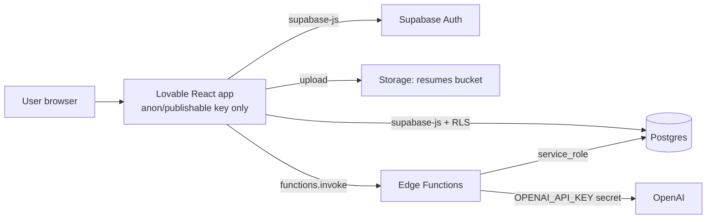

I'll check the project files for the hackathon criteria first, then walk you through the Lovable ↔ Supabase wiring.# Connecting Lovable (frontend) ↔ Supabase (backend)

## ✅ What I've understood — please confirm

| # | My understanding |
|---|---|
| 1 | You're building **JD Gap Coach** for the AI Generalist hackathon (per the project analysis doc), judged on Problem, Functionality, Creativity and Presentation. |
| 2 | The frontend was switched from **Bolt → Lovable** (the earlier plan said Bolt). Everything else stays: Supabase = Postgres + Auth + Storage + Edge Functions + OpenAI. |
| 3 | You've **already created a separate Supabase project** (tables / functions built there), and now want the Lovable UI to read/write to it. |
| 4 | You want to know **where** each setting goes (Lovable side vs Supabase side) and **how** to verify it works. |

> **One question that changes the steps:** In your Lovable project, did you already click **"Enable Cloud"** (Lovable's built-in backend)? If yes, the path is different — see the ⚠️ warning below.

---

## 🎯 Direct answer

**You configure the connection in Lovable, not in your code.** Lovable has a native Supabase connector — no manual `.env` wiring needed.

**Path:** In the editor, open More → Cloud and click "Already have a Supabase project? Connect it here." The link appears on projects that don't have a backend yet, next to the Enable Cloud option. Then in the Connect project step, which lists the Supabase projects in your linked organizations, click Connect next to the project you want to use.

Once connected, Lovable can see your tables, RLS policies, and functions — so it generates frontend code that matches your real schema.

> ⚠️ **Critical:** There is no one-click migration from the built-in backend (Cloud) to Supabase or the other way. If Lovable Cloud is already enabled on this project, the cleanest fix is a fresh Lovable project connected to your Supabase from the start, then re-prompt the UI.

---

## 🏗️ Architecture (what talks to what)



**Golden rule:** the browser holds only the **public anon key**. Secrets (OpenAI key, `service_role`) live **only** in Edge Function secrets. Always store sensitive API keys as Supabase Edge Function secrets rather than environment variables or in source code.

---

## 🗺️ Where to configure what

| Setting | Where | Value |
|---|---|---|
| Project link | **Lovable** → More → Cloud → Connect Supabase | Pick your project |
| Project URL + anon key | Auto-injected by Lovable into the Supabase client file | Don't hardcode manually |
| **Site URL** | **Supabase** → Authentication → URL Configuration | Your published Lovable URL (e.g. `https://jd-gap-coach.lovable.app`) |
| **Redirect URLs** | Same screen | Add preview URL **and** published URL (+ custom domain if any) |
| `OPENAI_API_KEY` | **Supabase** → Edge Functions → Secrets | Never in Lovable code |
| RLS policies | **Supabase** → Table editor / SQL | `user_id = auth.uid()` on every table |
| Storage bucket | **Supabase** → Storage → `resumes` (private) | Policy: user can access only own folder |
| CORS | Inside each Edge Function | Return `Access-Control-Allow-Origin` + handle `OPTIONS` |

---

## 🪜 Step-by-step

**Step 1 — Link the accounts**
Lovable → More → Cloud → *Connect it here* → authorise your Supabase org → Connect project.

**Step 2 — Fix Auth redirects (the #1 hackathon gotcha)**
Supabase → Authentication → URL Configuration → set Site URL + add both Lovable preview and published URLs. Without this, sign-up emails and Google login bounce to `localhost`.

**Step 3 — Lock down data with RLS**
```sql
alter table sessions enable row level security;
create policy "own sessions" on sessions
  for all using (auth.uid() = user_id)
  with check (auth.uid() = user_id);
-- repeat for resumes, requirements, questions, answers, red_flags
```
(For child tables like `requirements`, check ownership via a join to `sessions`.)

**Step 4 — Add secrets**
Supabase → Edge Functions → Secrets → `OPENAI_API_KEY`.

**Step 5 — Prompt Lovable to wire the UI**
> *"Using the connected Supabase project, build the Dashboard to list rows from `sessions` for the logged-in user, with create/delete. On the New Session screen, call the `score-gaps` Edge Function via `supabase.functions.invoke` and show a loading state, error state and retry."*

**Step 6 — Calling Edge Functions from the frontend**
```ts
const { data, error } = await supabase.functions.invoke('score-gaps', {
  body: { session_id }
});
if (error) showRetry(); else setReadiness(data.readiness_score);
```
`supabase.functions.invoke` sends the user's JWT automatically, so the function knows who's calling.

**Step 7 — Verify (do this by hour 32)**
- [ ] Sign up with user A → create session → visible
- [ ] Sign in as user B → user A's session **not** visible (RLS works)
- [ ] Browser DevTools → Network → no OpenAI key anywhere
- [ ] Test on the **published** URL, not just preview

---

## 🚨 Common failures & fixes

| Symptom | Cause | Fix |
|---|---|---|
| Empty lists, no error | RLS on, no policy | Add SELECT policy |
| Login redirects to localhost | Site URL not set | Step 2 |
| Edge Function CORS error | Missing OPTIONS handler | Return CORS headers in every response |
| Works in preview, fails live | Published URL not in redirects | Add it |
| 500 from function | Missing secret / bad JSON from LLM | Check Cloud tab → Logs for specific error messages, plus Supabase function logs |

---

## 🏆 Edge features this stack unlocks (to win)

These are cheap on Supabase and directly hit the rubric:

| Feature | How (Supabase) | Build cost | Criterion won |
|---|---|---|---|
| **Live-moving Readiness Score** | Supabase **Realtime** on `sessions.readiness_score` — dial animates the instant `grade-answer` updates the row | Low | Presentation + Creativity |
| **Streaming AI feedback** | Stream tokens from Edge Function so feedback types out instead of a spinner | Low–Med | Presentation (no dead air in Loom) |
| **Semantic evidence matching** | `pgvector` embeddings of resume bullets vs JD requirements — show the *exact* resume line as evidence | Medium | Functionality + Creativity |
| **Demo-safe fallback mode** | Cache the last good LLM JSON per session; serve it if OpenAI times out | Low | Functionality (never breaks on stage) |
| **Shareable Readiness Report** | Public read-only link via a signed token / `share_id` column | Low | Presentation ("send this to your mentor") |
| **Score history sparkline** | `score_history` table, one row per recalculation | Low | Before/after story made visible |

**Architect's pick for top 2:** Realtime score + Demo-safe fallback. One makes the demo memorable, the other makes sure it survives.

---

Confirm points 1–4 (and the Lovable Cloud question), and I'll give you the exact Lovable starter prompt plus the SQL for all six tables with RLS.

**Sources:**
- [Connect to Supabase – Lovable Documentation](https://docs.lovable.dev/integrations/supabase)
- [Lovable docs (GitHub) – troubleshooting](https://github.com/lovablelabs/docs/pull/116.patch)